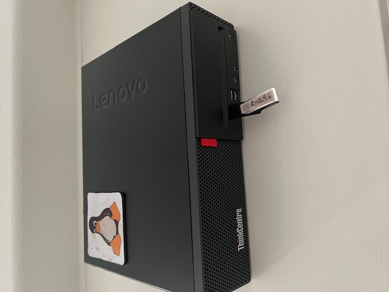
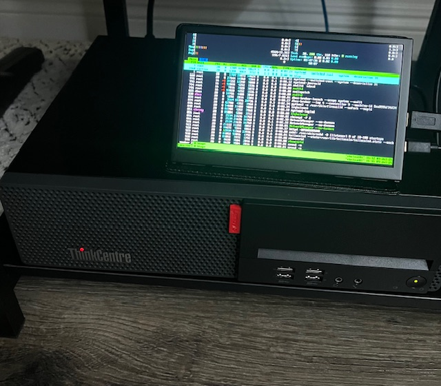
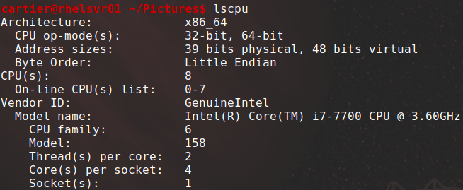
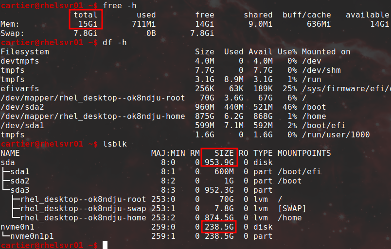
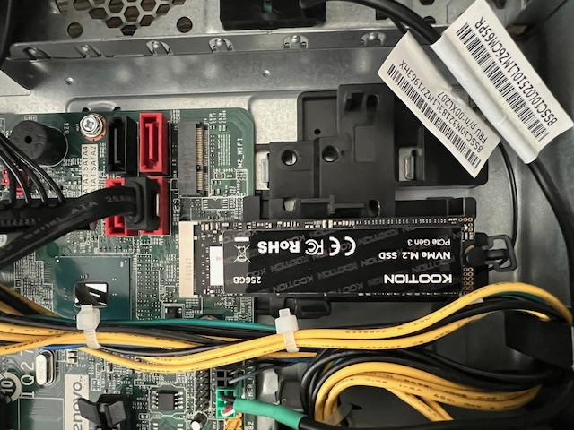
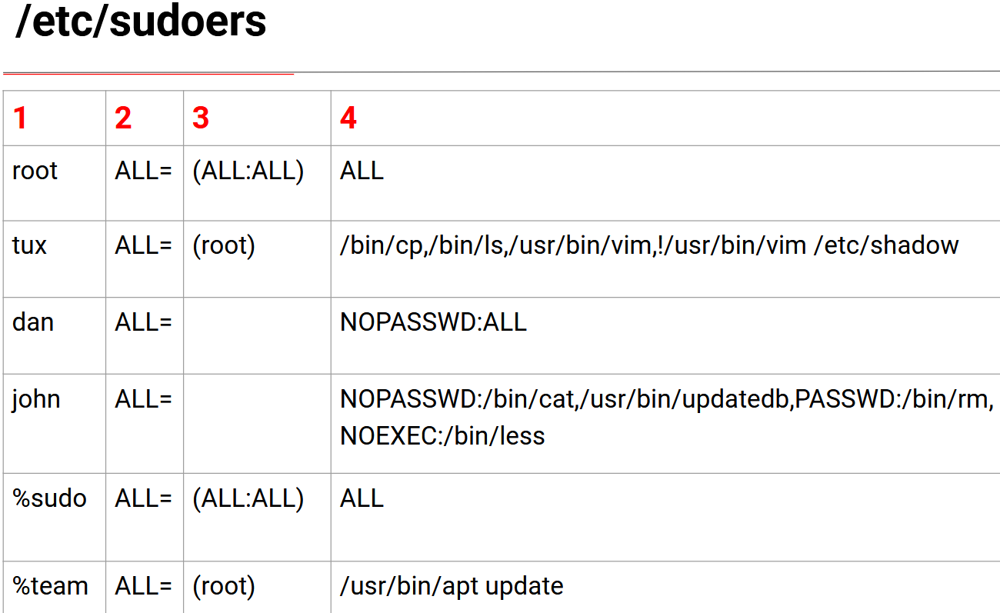

# RHCSA-Home-Lab

## Table of Contents

  - [Introduction](#intro)
  - [Basic Shell Skills](#basic)
  - [File Management Tools](#files)
  - [Managing Text Files](#awk)
  - [Local Consoles and SSH](#consoles)
  - [Users and Groups](#sudo)
  - [Permission Management](#perms)
  - [Configuring Networking](#networking)
  - [Managing Software](#dnf)
  - [Managing Processes](#procs)
  - [Working with Systemd](#systemd)
  - [Scheduling Tasks](#tasks)
  - [Configuring Logging](#logging)
  - [Managing Storage](#storage)
  - [LVM’s Managing Advanced Storage](#lvm)
  - [Stratisd](#stratis)
  - [Basic Kernel Management](#kernel)
  - [Managing Boot Procedure](#boot)
  - [Troubleshooting](#trouble)
  - [Configuring SSH](#sshd)
  - [Managing Apache](#apache)
  - [Managing SELinux](#selinux)
  - [Firewalld](#firewall)
  - [Accessing Network Storage](#nfs)
  - [Configuring Time Services](#time)
  - [Managing Containers](#containers)

## <a name="intro"></a>Introduction 
I decided to study for the RHCSA exam. This is a compilation of commands that I practiced and added to my notes while studying. For my labs I decided to use a mix of VM’s on Virtual Box and physical hardware to study for the Red Hat certification. By copying down the commands I run and looking them over I know it will help me retain the material. For this project I bought a refurbished Lenovo for $120 dollars with these specs:

Lenovo ThinkCentre M910S Intel i7 3.20 GHz, 16GB DDR4 RAM, 1TB SSD, and I installed an extra 256GB SSD.

***Lenovo ThinkCentre***
<p align="center"></p>
<p align="center"></p>

***CPU***
<p align="center"></p>

***Memory and Storage***
<p align="center"></p>

***Installed extra SSD***
<p align="center"></p>


## <a name="basic"></a>Basic Shell Skills
Vim Basics

```shell
dd # delete current line into memory
yy # copies current line
p # pastes current line
v # visual mode and you can select blocks of text. d to cut y to copy
u # undo last command
Ctrl+r # Redo last command. Only once
?text # search backwards 
^ # go to first position in current line
$ # go to end of line
:%s/old/new/g # replace all occurances of old w/ new. 'gc' to add confirmations
```

My personal .vimrc file:

```shell
syntax on
set number
set cursorline
set cursorcolumn
```

I/O Redirection

```shell
$ # STDIN 0<
$ # STDOUT 1>
$ # STDERR 2> 
$ ls wasd /etc 2>/dev/null > stdout.txt # discard stderr and save stdout to file
$ cat < /etc/passwd # send stdin to cat command
$ history | less # send stdout of history as stdin of less command
$ ls wasd /etc &> errout.txt # send both stderr and stdout to same file
```

History and Environment Variables

```shell
$ alias # view current aliases
$ which ls # find where shell will get ls command
$ type ls # find that ls is aliased to 'ls --color=auto'
$ history -d <number> # delete specfic number in history
$ history -c # clear current history in memory
$ history -w # clear current history file
$ env # list environment variables
```

Environment config files

```shell
$ /etc/profile # generic file processed by all users at login
$ /etc/bashrc # this file is processed when subshells are started
$ ~/.bash_profile # user specific login shell variables can be defined
$ ~/.bashrc # user specific subshell variables can be defined
# login shell is first shell opened for that user
```

/etc/motd and /etc/issue

```shell
$ /etc/motd # use to display a message after a user logs into a shell
$ /etc/issue # ues to display a message before a user logs in to a shell
```

Man Pages

```shell
# Man pages are categorized in different sections
# (1) Executable programs or shell commands
# (5) File formats and conventions
# (8) System administration commands
$ man 5 tar # access different sections
$ # append --help to most commands for brief usage
$ man ls # type /example for usage or look for See Also section
$ # serach the mandb with 'man -k' and 'apropos' using keywords
$ apropos partition
$ man -f ls
$ man -k ls
$ sudo mandb # update mandb
$ man ls 
	G # to go to bottom
	q # to exit
$ info '(coreutils) ls invocation' # read info page
$ ls /usr/share/doc # documentation files
```

[Back to Top](https://github.com/HunterCartier702/RHCSA-Home-Lab/blob/main/README.md#intro)

## <a name="files"></a>File Management Tools
Viewing Mounts

```shell
# a mount is a connection between a device and a directory
$ mount # lists all mounted devices and reads from /proc/mounts
$ df -Th # show available disk space on mounted devices
$ findmnt # show mounts and relationship between different mounts
```

Copy Files and Directories

```shell
$ ls -lrt # list recently modified files last 
$ cp /somedir/.* /tmp/ # copy all hidden files
$ cp -a /somedir/ /tmp/ # -a=archive. cp somedir and hidden and normal files to /tmp
$ cp -a /somedir/. . # copies all files regular and hidden to current dir
```

Using Links

```shell
$ touch file1; ln file1 file2 # create hard link
# cannot hard link to directories
# to create hard links you must be the owner of the item you want to link to
$ ln /etc/passwd . # this wont work as root owns this file
$ ln -s /etc/passwd . # creates a sym-link named passwd in current dir owned by current user
$ # unlink <file> or rm <file> to unlink. Just deletes the file
```

Archives and Compressed Files

```shell
# to archive a file you need read perms on it and execute perms on the directory the file resides in
$ mkdir testdir && touch testdir/file{1..100} # create junk in testdir
$ tar -cvf test-$(date +%F).tar testdir/ # archive testdir and files inside
$ tar -rvf existing.tar /etc/hosts # -r=append adds a file to an existing archive
$ tar -uvf existing.tar /home # update existing archive. write newer version of /home to archive
$ tar -tf existing.tar # to view contents of archive
$ file existing.tar # show what type of file
$ tar -xvf existing.tar # x=extract archive
$ tar -xvf existing.tar -C /tmp etc/hosts # unpack hosts file to /tmp
$ tar -xvf existing.tar etc/hosts # extract a only single file named hosts from archive
$ tar -cjvf test.tar.bz2 ./* # -j=bzip2. bzip2/bunzip2
$ tar -cJvf test.tar.xz ./* # -J=xz 
$ tar -czvf test.tar.gz ./* # z=gzip gzip/gunzip
```


[Back to Top](https://github.com/HunterCartier702/RHCSA-Home-Lab/blob/main/README.md#intro)

## <a name="awk"></a>Managing Text Files
Cut

```shell
$ ps aux | less -N --use-color # pipe long output to less pager and -N for line numbering
$ sudo tail -f /var/log/messages # monitors the last 10 lines 
$ # cut: -d=field-delimiter -f="number of fields"
$ cut -d : -f 1 /etc/passwd | sort # show only users in byte order
$ cut -d : -f 3 /etc/passwd | sort -n # sort 3rd field numerically
$ du -h | sort -rn # sort largest files first
$ sort -k3 -t : /etc/passwd # sort third column w/ field-sep :
$ ps aux | sort -k 4 -nr | less # numerically reverse sort memory usage. 
$ ps aux | wc
		lines  words  chars
    200    2267   17520
```

Simple Regex

```shell
# safer to quote expressions
$ grep '^anna' /etc/passwd # search lines where anna is at the beginning
$ grep 'bash$' /etc/passwd # search lines that end w/ bash
$ grep 'r..t' /etc/passwd # '.' is a single wildcard
$ grep 'r[aut]t' /etc/passwd # matches a single char from the range of chars
$ ls -R Pictures/*.png # '*' match zero or more previous chars
$ grep 're\{2\}t' /etc/passwd # matches reed not red. If you know how many of the previous chars you want to match. 
$ grep 'ro\{1,3\}t' /etc/passwd # matchs min 1 max 3 of previous char
$ grep 'ro\?t' /etc/passwd # matches zero or one of the previous char
$ grep 'ro\+t' /etc/passwd # matches one or more of the previous char
$ (...) # group multiple chars so that regex can appy to the group
$ grep -v -e '^#' -e '^$' /etc/services | less # exclude blank lines and lines that start w/ #
```

awk and sed

```shell
$ awk -F : '{ print $4 }' /etc/passwd # prints only the 4th field
$ awk -F : '/user/ { print $4 }' /etc/passwd # print 4th field of any line w/ user
$ sed -n 5p /etc/passwd # print the 5th line in passwd file
$ sed -i 's/old/new/g' ~/newfile.txt # replace old text w/ new
$ sed -i -e '2d;20,25d' ~/newfile.txt # delete lines 2 and 20-25
$ sed -i -e '2d' ~/newfile.txt # del only line 2
```

[Back to Top](https://github.com/HunterCartier702/RHCSA-Home-Lab/blob/main/README.md#intro)

## <a name="consoles"></a>Local Consoles and SSH
Non-graphical Environments

```shell
# Virtual terminals allow you to open 6 different terminal windows on the same console.
# Press Alt+F1-6 to switch between consoles or use chvt.
# Ctrl+Alt+fn+F7 is the graphical console in graphical environments
$ sudo chvt 1 # Press 1-6 to switch. 7 for graphical console if there is one
```

Reboot and Poweroff

```shell
$ sudo systemctl reboot 
$ sudo systemctl halt
$ sudo systemctl poweroff
or 
$ sudo reboot # symlinked to /bin/systemctl
$ ls -l $(which reboot)
$ echo b > /proc/sysrq-trigger # from root shell to reset machine. Use as last resort
```

SSH and Related Utilities

```shell
$ sudo systecmctl status sshd # check if service is running
$ sed -i -e '25d' ~/.ssh/known_hosts # remove fingerprint if misatch from changes
$ ssh -Y user@server # connect to server and start graphical applications assuming X server is running and allowed
$ ssh -p 2222 user@server # change port
```

SCP Secure Copy

```shell
$ scp /etc/hosts rhelsvr01:/tmp # connect using current user acc to transfer file
$ scp cartier@rhelsvr01:/etc/hosts . # connect as user cartier and transfer hosts file to current directory
$ scp -r rhelsvr01:/etc/ /tmp # recursively copy subdirectory to local tmp dir
$ # -P to specify non-default port
$ sftp cartier@rhelsvr01 # enter password and access files with interactive prompt
	ls
	pwd # show current remote dir
	lpwd # show local current dir
	lcd /tmp # change local dir
	put secret_file.txt # upload a file
	exit
```

Key-based Auth

```shell
$ ssh-keygen # generate keys and run through prompts
$ ssh-copy-id rhelsvr01 # copy .pub key to remote server
```

[Back to Top](https://github.com/HunterCartier702/RHCSA-Home-Lab/blob/main/README.md#intro)

## <a name="sudo"></a>Users and Groups
sudo and visudo

<p align="center"></p>

```shell
# 1. First field is user and % prefix is for Groups.
# 2. ALL= means all hosts. (useful in distributed environments with shared sudoers files).
# 3. User:Groups. Root user can run cmds as all users. tux can run cmds as root. If blank the root is implied
# 4. Commands to which the rule applies. Use absolute path and seperate by a comma. An ! mark before command name negates or forbids the user from running it
# Dan can run all commands without being prompted for sudo passwd
# NOEXEC prevents spawning other commands with same privs

$ sudo visudo # to edit /etc/sudoers file
# or add a file to /etc/sudoers.d/ for a user 
# files in sudoers.d/ must be owned by root with 0440 perms
#/etc/sudoers.d/jdoe
$ which systemctl
$ jdoe ALL=(ALL) NOPASSWD: /usr/bin/systemctl restart apache2
$ linda ALL=/usr/bin/useradd, /usr/bin/passwd,! /usr/bin/passwd root
$ pkexec visudo # in case you lock root account
```

```shell
$ sudo -i
$ useradd betty; useradd amy
$ echo password | passwd --sdtin betty; echo password | passwd --stdin amy
$ exit
$ sudo sh -c 'echo "amy ALL=/usr/bin/useradd, /usr/bin/passwd, ! /usr/bin/passwd root" > /etc/sudoers.d/amy'
$ su - amy
$ sudo passwd betty
	success
$ sudo passwd root
	failure
```

User Accounts

```shell
# vipw=edit passwd, vipw -s=edit shadow, and vigr=edit group. Not recommended
$ sudo useradd -m -d /home/james -c “IT Guy” -s /bin/bash -G sudo,adm,mail james #end command with username. -m=creates home dir. -d=specify dir to put home dir. -s=default shell. -g=add user to another primary group, not common. -G=adds user to secondary group
# the /etc/skel dir contains files that are copied to the user home dir when created
# default shell for users is /bin/bash and system users is /sbin/nologin
# use usermod or passwd -s to change this
$ sudo useradd james -s /sbin/nologin # change shell from /bin/bash
$ usermod # use for modifying user properties execpt passwords. use passwd command
```

Configuration Files for Users

```shell
# when using useradd some default values are assumed in two config files:
$ /etc/default/useradd # contains the SKEL and SHELL vars
$ /etc/login.defs 
# Important default vars in login.defs:
# MOTD_FILE, ENV_PATH, PASS_MAX_DAYS, PASS_MIN_DAYS, PASS_WARN_DAYS, UID_MIN, CREATE_HOME
```

Managing Password Properties

```shell
# set password for james to min usage period of 30 days, expire after 90 days, and warning berfore 3 days:
$ sudo passwd -n 30 -w 30 -x 90 james
$ sudo chage -E 2025-12-31 james # set expire date
$ chage -l james # see current passwd settings
$ chage james # enter interactive mode
# interactive mode options:
Minimum Password Age [0]: 30
The minimum number of days a user must wait after changing their password before they can change it again.

Maximum Password Age [99999]: 180
The maximum number of days a password is valid before the system forces the user to change it.

Last Password Change (YYYY-MM-DD) [2025-07-08]:
The last time the password was changed.

Password Expiration Warning [7]: 14
How many days before the password expires the user gets a warning.

Password Inactive [-1]: 3
Number of days after a password expires before the account is disabled (i.e., login not allowed).

Account Expiration Date (YYYY-MM-DD) [-1]:
The date the account itself expires, not just the password.
Default: -1 means the account never expires.
```

Creating User Environment

```shell
 # when a user logs in an environment is created. These files play a role:
 /etc/profile # Used for default setting for all users when starting a login shell
 /etc/bashrc # Used to define defaults for all users when starting a subshell
 ~/.profile # specific settings for one user applied when starting a login shell
 ~/.bashrc # specific settings for one user applied when starting a subshell
 # When logging in these files are read in this order. 
 # Variables and other settings are defined and applied from these files
 # If a variable or setting occurs in more than one setting, the last one wins
```

Managing Group Accounts

```shell
/etc/group # only shows names of users who are a member of this as a secondary group
$ sudo groupadd ssh_users # create a group
$ groupmod # use to change group name or gid, but not change group members, use usermod
$ lid -g wheel # check members of a group
$ groupmems -g wheel -l # show secondary and primary group users
$ groupmod -aG ssh_users linda
$ id linda
```

[Back to Top](https://github.com/HunterCartier702/RHCSA-Home-Lab/blob/main/README.md#intro)

## <a name="perms"></a>Permission Management
Change Ownership

```shell
$ find / -user linda # search files owned by linda
$ find / -group ssh_users # find files owned by a group
$ chown user01:ssh_users test_file # change user and group ownership
$ chown -R user02:user02 testdir/ # recursively change ownership of directory and below
$ chgrp user01 testfile # change only group 
```

newgrp command

```shell
$ groups user01 # show primary group followed by secondary groups
	user01 : user01 wannabe_admins archusers
$ su - user01
$ newgrp archusers # open new shell with primary group archusers. (temporary)
$ groups
	archusers user01 wannabe_admins
$ touch LinuxMintIsBetter # create a file named after factual information
$ ll
	total 0
	-rw-r--r--. 1 user01 archusers 0 Jul 21 11:43 LinuxMintIsBetter # group changed
$ exit
$ groups
	user01 wannabe_admins archusers # changed back to normal
# user must be part of group specified or will be prompted for a password stored in gpasswd
```

Understanding Read, Write, and Execute Permissions

```shell
Permission        Applied to Files        Applied to Directories
----------        ----------------        ----------------------
Read             View file content        List contents of directory
Write        Change contents of a file    Create and delete files and subdirs
Execute         Run a program file        Change to the directory
```

Applying Permissions

```shell
$ chmod 740 somefile # absolute mode. (my preferred mode)
$ chmod u+x somefile # relative mode.
$ chmod +x somefile # omit "to whom" part to apply to all entries
$ chmod -R a+X files/ # change execute perms recursively for all subdirectories and not files
```

Understanding Advanced Permissions

```shell
# 4 set user ID (SUID)
# file will run as set user
$ ll /usr/bin/passwd
	-rwsr-xr-x. 1 root root 32648 Aug 10  2021 /usr/bin/passwd
# lowercase s means SUID and execute is set. Capital S means only SUID is set

# 2 set group ID (SGID)
# If set on an executable, gives user perms of group owner of that file when executed
# If set on a directory, all subdirectories and files obtain that set group ownership (more useful than above)
$ ll
	drwxr-sr-x. 2 user01 devops 30 Jul 21 13:27 dev_ops # SGID bit set
$ ll dev_ops/
	-rw-r--r--. 1 user01 devops 0 Jul 21 13:27 go_lang_proj.txt # created file owned by that group

# 1 sticky bit 
# when applied, can delete a file only if root, owner, owner of dir where file located
$ ls -ld /tmp
	drwxrwxrwt. 14 root root 4096 Jul 21 13:26 /tmp
```

Applying Advanced Permissions

```shell
$ chmod 4755 somedir/ # apply SGID to a directory
$ chmod u+s # SUID
$ chmod g+s # SGID
$ chmod +t # # sticky bit
$ chmod g+s,o+t data/sales/


Permission  On Files                   On Directories
---------   --------                   --------------

SUID        User executes file w/      No meaning
            perms of owner
            
SGID        User executes file w/      Files created in directory get the       
            perms of group owner       same group owner

Stickybit   No meaning                 Prevents users from deleting fies from 
                                       other users
```

Umask

```shell
# Files default permissions: 666
# Directory default permissions: 777
# umask 022 gives 644 for new files and 755 for new directories
Two ways to edit change defualt umask. useradd uses /etc/login.defs
1. add a umask.sh containing umask in /etc/profile.d/ directory 
2. edit .profile or .bashrc file for each specific user account
```

Attributes

```shell
$ man chattr
$ chattr +s somefile # set s attribute
$ chattr -s somefile # remove s attribute
$ lsattr # list attributes
```

[Back to Top](https://github.com/HunterCartier702/RHCSA-Home-Lab/blob/main/README.md#intro)

## <a name="networking"></a>Configuring Networking
addr and link

```shell
$ ip addr # configure and monitor network addresses
$ ip route # configure and monitor routing information
$ ip link # configure and monitor link state

# changes with ip command are not persistent after reboots
$ ip addr show # list network interfaces
$ ip -br addr show # better readability
$ ip -c a # -c=add color 
$ ip link show # show only link info
$ ip -s link show # shows rx and tx packet info
$ ip link set eth0 up # bring interface up or down
```

Routing

```shell
$ ip route show # show routing info. -c for color
# line 1 shows default route
# line 2 shows lines that identify local connected networks
```

Ports and Services

```shell
$ ss -lt # show listening tcp ports
$ ss -tulpn # tcp, udp, listen, process, and numeric
# ip4 loopback 127.0.0.1, ip6 loopback ::1
# listening for all ip4 addrs *, listening for all ip6 addrs :::*
```

nmtui and nmcli

```shell
# RHEL 9 is managed by the NetworkManager service
$ systemctl status NetworkManager # verify its status
# when this service comes up it reads network card configuration scripts located at
# /etc/NetworkManager/system-connections/
# these scripts have a name that starts with its network interface name
device - a network interface card
connection - configuration used on a device
# you can create multiple connections for a device
$ nmcli general permissions 
```

nmcli

```shell
$ man nmcli
$ man nmcli-examples
$ man nmcli | grep -A 15 ^EXAMPLES
$ man 5 nm-settings-nmcli
# tab auto-complete can be helpful. (bash-completion package)
$ nmcli <tab twice> 
$ nmcli connection <tab twice>

$ nmcli con show # show all connections
$ nmcli con show enp0s3 # show all properties of connection. long list
$ man 5 nm-settings # find out what these settings are doing
$ nmcli # overview of current configured devices and status
$ nmcli dev status # list all devices
$ nmcli dev show enp0s3 # settings for a specific device
```

Manage Network Connections: create a connection and manage its status

```shell
# run from console session, not SSH
# create network connection named dhcp, type ethernet, auto=dhcp:
$ nmcli con add con-name dhcp type ethernet ifname enp0s3 ipv4.method auto 
# create network connection named static. define static ip and gateway:
$ nmcli con add con-name static ifname enp0s3 autoconnect no type ethernet ipv4.method manual ip4 10.0.0.10/24 gw4 10.0.0.1
$ nmcli con show
$ nmcli con up static # switch to connection named static
$ nmcli con up dhcp # switch to connection named dhcp
$ nmcli con up enp0s3 # switch back to default
$ nmcli con mod # change current connection properties
# while adding a con use 'ip4' but while modifying existing con use 'ipv4'

# change autoconnect at reboot
$ nmcli con mod static connection.autoconnect yes
$ nmcli con mod dhcp connection.autoconnect no

$ nmcli -f name,autoconnect,autoconnect-priority,state c s # show con name and autoconnect property. -f=fields
$ nmcli -f <tab twice> # show possible fields
$ nmcli con add type <tab twice> # see all options
# connection.autoconnect-priority <default 0> low priority=-999 to 999=high priority

$ nmcli con mod enp0s3 ipv4.dns "8.8.8.8 1.1.1.1" # add multiple dns servers 
$ nmcli con show enp0s3 | grep ipv4.dns: # verify dns set serversnmc
```

Change Connection Parameters with nmcli

```shell
# while ADDING a con use 'ip4' but while MODifying existing con use 'ipv4'
$ nmcli con mod static connection.autoconnect no # make sure connection named static does not connect automatically
# or just 'nmcli con mod static autoconnect no'
$ nmcli con mod static ipv4.dns 10.0.0.10 # add/change dns server to connection
$ nmcli con mod static +ipv4.dns 8.8.8.8 # append second item w/ same params use +
$ nmcli con mod static ipv4.addresses 10.0.0.100/24 # change parameter of existing ip
$ nmcli con mod static +ipv4.addresses 10.20.30.40/16 # add second ip, use + sign
$ nmcli con up static # activate connection properties. down then up to reset

# You can modify an existing connection’s IP address and gateway using nmcli like this
$ nmcli con mod enp0s3 ipv4.addresses 192.168.1.50/24 ipv4.gateway 192.168.1.1 ipv4.method manual
```

nmtui

```shell
# 3 menu options of nmtui
Edit a connection # create new connections or edit existing
Activate a connection # use to re-activate a connection
Set system hostname # set hostname of computer
# after editing a connection you need to deactivate and activate it again!
$ nm-connection-editor # GUI
```

Hostname and Name Resolution

```shell
# 3 ways to change hostname
$ nmtui
$ hostnamectl set-hostname <hostname>
$ /etc/hostname

$ hostnamectl set-hostname rhelsver.rh.com # set hostname
$ hostnamectl status # check changes
$ cat /etc/hostname # check changes
```

/etc/hosts

```shell
# hostnames will be looked up first before dns is used in /etc/hosts if
# set in /etc/nsswitch.conf like this:
$ cat /etc/nsswitch | grep ^hosts:
	hosts: file dns myhostname
	# file: The system first checks /etc/hosts for a match. This is fast and local.
	# dns: If the hostname isn't found in /etc/hosts, it queries a DNS server (as configured in /etc/resolv.conf).
	# myhostname: If still unresolved, it checks the system's own hostname (like localhost, your-machine-name, etc.). This is provided by the systemd-hostnamed service if you’re using systemd.

$ cat /etc/hosts
	# <ip>  <fqdn> <shortname> 
	192.168.0.131	rhelsvr01.example.com rhelsvr01

# for actual dns you should set using tools like nmcli
$ nmcli con mod enp0s3 +ipv4.dns "1.1.1.1 8.8.8.8" # '+' if appending

# if your computer is configured to get the network config from a dhcp server, the dns server is also set via dhcp. if you do not want this to happen use this command
$ nmcli con mod enp0s3 ipv4.ignore-auto-dns yes
	# yes = ignore the DNS servers assigned via DHCP (don’t use them)
	# no (default) = accept and use the DNS servers assigned by DHCP

# After modifying the connection, restart it for the changes to take effect
$ nmcli con down enp0s3 && nmcli con up enp0s3

$ getent hosts rhelsvr01 # get entries from Name Service Switch libraries. nsswitch
```

[Back to Top](https://github.com/HunterCartier702/RHCSA-Home-Lab/blob/main/README.md#intro)

## <a name="dnf"></a>Managing Software
Register and Attach Subscriptions to a System (not needed for RHCSA??)

```shell
$ subscription-manager # tool to manage software from cli
$ subscription-manager register # will prompt for red hat creds to register
$ subscription-manager list --available # see what account is entitled to
$ subscription-manager attach --auto # registering is not enough. use to auto attach subscription to repos available
$ subscription-manager list --consumed # see what subscriptions currently using
$ subscription-manager unregister # unregister if you have a limited number of systems
$ /etc/pki/ # after registering and attaching a subscription, entitlement certificates are written here
$ dnf repolist # list enabled repos
$ dnf repolist --all # list disabled and enabled repos
```

Specifying Repo to Use (outdated - use config-manager)

```shell
# to tell your server which repo to use, create a '.repo' file in:
$ /etc/yum.repos.d/
# at a minimum the file needs these params:
[label] # .repo file can contain different repos. each section starting with a label that ids the specific repo
name= # specify the name of repo to use
baseurl= # contains the url that points to a specific location
# for RHCSA include 
gpgcheck=0 # will do gpg check without option
 
# Optional but commonly used:
enabled=1: # Enables the repo (defaults to 1 if not specified).
gpgcheck=1: # Enables GPG signature checking (recommended for security).
gpgkey=: # URL or path to the GPG key if gpgcheck=1.
```

Using config-manager 

```shell
# creates repo client file for you specifying the repo using http:
$ dnf config-manager --add-repo=http://myrepo.example.com/BaseOS
$ dnf config-manager --add-repo=file:///repo/BaseOS # adds the local test repo
gpgcheck=0 # add to newly created .repo file to disable gpg checking
$ dnf repolist # to show new repo enabled
# use http://, ftp://, or file://
$ dnf repository-packages <repoID> list
```

Using DNF

```shell
$ dnf search <packageName> # search packages for a string that occurs in the package name or summary
$ dnf search all <packageName> # search packages for string that occurs in the package name, summary, or description
$ dnf provides */createrepo # perform deep search in the package to look for. Will show name of package
$ dnf info <packageName> # provide more info on a package
$ dnf clean all # remove all stored metedata
$ dnf [install|remove] <packageName> # install or remove a package
$ dnf list [all|installed] # list all or installed packages
$ dnf list kernel # show current and available kernel if any
$ dnf upgrade <packageName> # upgrade all packages or specified package

$ dnf group list # list package group
$ dnf group install <groupName> # install group packages
$ dnf group list hidden # list subgroups
$ dnf group info "Container Management" # to see what is in a group
```

Managing Package Modules

```shell
$ man dnf.modularity
$ dnf module list <moduleName> # list all available modules in enabled repos or list specific streams
$ dnf module info [php|php:8.1] # see info on a stream or stream version
$ dnf module enable php:8.3/common # dnf module enable <name>:<stream>/<profile>
$ dnf module list php # php  8.3 [e]. e means enabled
$ dnf module list --enabled 
$ dnf module reset php
$ dnf module list php # php  8.3 [d] # d means disabled
```

RPM

```shell
$ rpm -qa | less # search all installed packages. /openssh for faster search
$ rpm -ql openssh-server # list files included in package and configs
$ rpm -qd openssh-server # show all documentation for a package
$ rpm -qc openssh-server # show all config files for package
$ rpm -qf /bin/ls # find the name of the package ls comes from
$ sudo rpm -i ./package.rpm # install specified package but not dependencies
```

Creating a repo with a mounted ISO file in a VM

```shell
# attach the ISO directly to the VM as if it were a DVD:
1. Go to Settings > Storage.
2. Under the IDE or SATA controller, click the empty disk icon.
3. Click the CD icon on the right → Choose a disk file → select your ISO (e.g., rhel-9.iso).
4. Start the VM.
$ umount /dev/sr0 # this is where the ISO automounts to. use lsblk
$ mkdir /repo # create mount point 
$ lsblk -f # grab UUID
$ vi /etc/fstab 
	UUID=<uuid> /repo iso9660 defaults 0 0 # add to fstab for reboot persistance
$ mount -a # mount all in fstab. will list any errors
$ mount | grep sr0 # check if mounted
$ ls /repo # will list BaseOS and Appstream which are the repos
$ dnf config-manager --add-repo="file:///repo/BaseOS" # create .repo file
$ dnf config-manager --add-repo="file:///repo/AppStream"
$ dnf repolist # list repos. There were none prior
$ gpgcheck=0 # go into the new .repo files and add this
# Now you can install some packages
```

[Back to Top](https://github.com/HunterCartier702/RHCSA-Home-Lab/blob/main/README.md#intro)

## <a name="procs"></a>Managing Processes
Managing Jobs

```shell
$ & # background a job if appended to commands
$ Ctrl+Z # Stops job temporarily
$ Ctrl+D # Sends EOF character to job to indicate stop waiting for input
$ Ctrl+C # Cancel cuurent interactive job
$ bg # background job after using Ctrl+Z
$ fg # foreground job
$ jobs # list job id and use fg 1 to foreground
$ top # type k, then PID, to kill a process
```

Managing Process Priorities

```shell
$ nice # change start process priority
$ renice # change active process priority
$ top # type r, enter PID to change nice value

$ nice -n 5 if=/dev/zero if=/dev/null & 
$ ps aux | grep dd # list pid
$ renice -n 10 -p 1234 # lower prioority by pid
$ top # shows dd at the top. type k to kill 
```

Sending Signals

```shell
$ man 7 signal # overview of signals
$ SIGTERM (15) # asks to stop a process
$ SIGKILL (9) # force a process to stop
$ SIGHUP (1) # hang up process. proccess will reread its configuration file
$ kill <pid> # kill command sends signals to process, default SIGTERM 15
$ kill -9 <pid> # send SIGKILL to a process
$ kill -l # list available signals for kill
$ ps fax | grep -B5 dd # shows hierarchy of dd process and ppid that started it
$ killall <processname> # to kill all processes by name

$ ps aux | grep defunct # list zombie procs
$ kill -SIGCHLD <PPID> # tell parent proc to rem child procs. systemd will adopt and then removed after a few seconds
$ kill -9 <pid> # if above fails
```

top

```shell
$ top # start top, view load avg and processes
$ R # running
$ S # sleeping
$ Z # zombie
$ k # enter pid to kill from within top
$ r # edit nice value or process
# load avg should not be higher than number of cores. 'lscpu' to check
```

tuned

```shell
$ dnf install -y tuned
$ systemctl enable --now tuned # enable and start 
$ tuned-adm active # check current active profile
$ tuned-adm list # view profiles available
$ tuned-adm recommend # gives a recommendation
$ tuned-adm profile virtual-guest # switch active to virtual-guest
```

[Back to Top](https://github.com/HunterCartier702/RHCSA-Home-Lab/blob/main/README.md#intro)

## <a name="systemd"></a>Working with Systemd
Units

```shell
$ systemctl -t help # list unit types
$ #Unit files are found in these locations:
$ /run/systemd/system # hightest order of precedence. Contains unit files that have been generated automatically. overwrites settings set elsewhere
$ /etc/systemd/system # second order of precedence. contains custom unit files
$ /usr/lib/systemd/system # third order of precedence. contains default unit files from installed packages. Do not edit directly
$ systemd.unit(5) and systemd.service(5) man pages
```

Service Unit (*.service files)

```shell
# used to start any type of service. you can start any process, daemon processes or commands
# service files contain 3 sections. Unit, Service, and Install:

# the first part describes unit and defines dependencies
# After statement, which indicates that this unit should start after the listed unit
# the Before indicates that this should start before the listed unit
[Unit]
Description=OpenBSD Secure Shell server
After=network.target 
[Service]
Type=notify
ExecStart=/usr/sbin/sshd -D $SSHD_OPTS
# describes how to start and stop a service and request installation
# type option is used to specify how the process should start
[Install]
WantedBy=multi-user.target
# indicates in which target this unit has to be started
$ man 5 systemd.service # more details
```

Mount Units (*.mount files)

```shell
# mount units specify how a file system should be mounted on a specific directory
# mount units are an alternative for mounting file systems through /etc/fstab
[Unit]
[Mount]
What=tmpfs
Where=/tmp
Type=tmpfs
Options=nosuid,nodev,noexec
[Install]
```

Socket Units (*.socket files)

```shell
# a socket creates a method for applications to communicate
# a socket can be defined as a port or file that systemd will listen on
# the service doesnt have to run unless a connection comes to the socket
# every socket NEEDS a corresponding service file
[Unit]
Wants=cockpit-issue.service # the wanted service file
[Socket]
ListenStream=9090
[Install]
WantedBy=sockets.target

$ ListenStream= # defines the TCP port systemd should listen on
$ ListenDatagram= # for UDP
```

Target Units (*.target files)

```shell
# a target unit is a group of units
# targets can have dependencies on other targets
# the dependencies are defined in a target unit
[Unit]
$ systemctl list-dependencies 
# target files don't contain info on units that should be included
# that is defined in the [Install] section of different unit files
# when using 'systemctl enable', the [Install] section of that unit is considered to determine which target should be added
# when you add a unit to a target a symbolic link is created under the hood in the target dir in /etc/systemd/system
# if you enable vstpd service, a symbolic link will be added in /etc/systemd/system/multi-user.target.wants/vstpd.service 
# and it will point to the unit in /usr/lib/systemd/system/vstpd.service to automatically start
# to systemd a 'want' a symbolic link is known as a want
```

Managing Units Through Systemd

```shell
$ dnf install -y vsftpd
$ systemctl status vsftpd # verify status. rhel disables at install unlike ubuntu
$ systemctl start vsftpd # start service only until reboot
$ systemctl enable vsftpd # start automatically enabled. output shows sym-link
$ systemctl enable --now vsftpd # start automatically and start now 
```

systemctl unit commands

```shell
$ systemctl -t service # show only service units
$ systemctl list-units -t service # show all active service units(same above)
$ systemctl list-units -t service --all # show all inactive service units
$ systemctl --failed -t service # show all failed services
$ systemctl status -l sshd.service # show detailed info about services
```

Managing Dependencies

```shell
# 2 ways to manage dependencies
# 1. unit types socket, timer, path are directly related to a service unit
# systemd makes a connection because the first part of the name matches(cockpit.socket, cockpit.service)
# accessing either of them will trigger the service unit
# 2. dependencies can be defined in the unit with Requires, Before, After, and Requisite
$ systemctl list-dependencies <unitName> # list dependencies
$ systemctl list-dependencies <unitName> --reverse # list Required units for this unit to be started
# ensure accurate dependency management w/ keywords in [Unit] section:
Requires # if this unit loads, units here will be loaded. if one is deactivated, this unit will deactivate
Requisite # if unit here is not loaded already, this unit will fail
Wants # the unit wants to load the units here, but will not fail if any listed units fail
Before # this unit will start before unit specified here
After # this unit will start after the unit specified here
```

Managing Unit Options

```shell
$ systemctl show sshd # show options available for specific unit. sshd.service unit in this example
$ systemctl edit # edit unit files in /etc/systemd/system, where custom unit files are created
# systemctl edit command creates a subdirectory of the service specified. example:
$ systemctl edit httpd.service # creates /etc/systemd/system/httpd.service.d/ and a file named override.conf is created
# all settings applied in this file over-write any existing settings in /usr/lib/systemd/system

$ dnf install -y httpd # install Apache2
$ systemctl cat httpd.service # show current config of unit file that starts apache
$ systemctl show httpd.service # print available config options for unit file
$ echo 'export SYSTEMD_EDITOR="/bin/vim"' >> .bashrc # set vim to systemd editor
$ systemctl edit httpd.service # add this to the override file:
	[Service] # add the section to add to 
	Restart=Always # Ensures httpd will restart after a failure
	RestartSec=5s #  Wait 10 seconds before restarting
$ systemctl daemon-reload # re-reads the systemd unit files
$ systemctl start httpd # start service 
$ systemctl status httpd # check status
$ pkill httpd # kill the service
$ systemctl status httpd # will be stopped but will restart in 5 seconds
$ systemctl revert httpd.service # This deletes the drop-in override and reverts to the default unit file.
```

Man Pages

```shell
$ man systemd.unit # general unit directives
$ man systemd.service # service-specific directives
$ man systemd.mount # for .mount units
$ man systemd.socket # for .socket units
$ man systemd.directives # list directives
```

\[Unit\] Purpose: Defines metadata and dependencies.

```shell
$ Description= # Human-readable summary of the unit
$ After= # Start this unit after another
$ Requires= # Hard dependency — starts listed unit too
$ Wants= # Soft dependency — starts if available
$ Conflicts= # Prevents this unit from running with another
$ ConditionXYZ= # Conditional checks (e.g., ConditionPathExists=)
```

\[Service\] Purpose: Used in .service unit files — defines how to start and manage the service.

```shell
$ ExecStart= # Command to start the service
$ ExecStop= # Command to stop it
$ ExecReload= # Command to reload it
$ Restart= # Restart policy on failure
$ RestartSec= # Time to wait before restarting
$ User= / Group= # Runs the service as this user or group
$ Environment= # Set environment variables
$ Type= # Tells systemd how to track the service (e.g., simple, forking)
```

\[Install\] Purpose: Defines how the unit integrates into systemctl enable and startup targets.

```shell
$ WantedBy= # Makes this unit start when the listed target is reached (e.g., multi-user.target)
$ RequiredBy= # Like WantedBy, but a hard dependency
$ Alias= # Creates symlink aliases for the unit
```

\[Socket\] Used in .socket units — defines how to listen for incoming connections.

```shell
$ ListenStream= # Listen on a TCP port or Unix stream socket
$ ListenDatagram= # Listen on a datagram socket (UDP-like)
$ Accept= # Whether to spawn a service per connection (yes/no)
$ Service= # Which .service unit to activate on connection
$ SocketUser= # User to own the socket
$ SocketGroup= # Group to own the socket
```

\[Mount\] Used in .mount units — defines mount points like /etc/fstab.

```shell
$ What= # Source device or filesystem
$ Where= # Mount point directory
$ Type= # Filesystem type (e.g., ext4, nfs)
$ Options= # Mount options (noatime, ro, etc.)
```

[Back to Top](https://github.com/HunterCartier702/RHCSA-Home-Lab/blob/main/README.md#intro)

## <a name="tasks"></a>Scheduling Tasks
Systemd Timers (*.timer files)

```shell
# 'systemd timers' are the default solution for scheduling tasks
# 'cron' is legacy and 'at' is for sheduling occasional jobs

# Timers are always used with Service files, and the names should match
# the 'Service' unit defines how it should start, 'Timer' unit defines when.
# if you need a Service to be started by a Timer, you enable the Timer, not the Service
$ systemctl cat logrotate.timer # also accompanies logrotate.service
# to define how the timer should be started use, [Timer]
[Timer]
OnCalendar=daily # describes when timer executes. current is daily
AccuracySec=1h # time window within it should execute
Persistent=true # must have OnCalendar set. takes boolean logic. it set to true, it stores the last time it was triggered on disk to trigger when needed
# Important options:
OnActiveSec= # defines a timer relative to the moment the timer is activated
OnBootSec= # defines a timer relative to when the machine was booted
OnStartupSec= # specifies a time relative to when the service manager was started. 
OnCalender= # defines timers on calender event expressions like 'daily'. see 'man systemd.time'
$ man systemd.time

$ systemctl list-units -t timer # list all timers
$ systemctl list-unit-files logrotate.* # lists .service and .timer
$ systemctl cat logrotate.service # there is no [Install] section
$ systemctl status logrotate.service # shows 'TriggeredBy: logrotate.timer'
$ dnf instal -y sysstat 
$ systemctl list-unit-files sysstat*.* # show unit files added from package
$ systemctl cat sysstat-collection.timer # shows OnCalendar=*:00/10 which ensures that it will run every 10 minutes
```

Cron Timing

```shell
# crond service USED to be the default to schedule tasks
# crond is enabled by default and the crond daemon wakes up every minute and checks its configuration and runs tasks
$ systemctl status crond

Field         Values
-----         ------
Minute        0-59
Hour          0-23
Day of Month  1-31
Month         1-12 (or jan,feb,mar,apr ...)
Day of Week   0-7 (Sunday is 0 or 7), or sun,mon,tue,wed,thu,fri,sat

* 11 * * * # any minute between 11:00 and 11:59
0 11 * * 1-5 # everyday at 11am mon-fri
0 7-18 * * 1-5 # every hour at the top of the hour between 7am and 6pm
0 */2 2 12 5 # Run at minute 0 of every 2nd hour, but only on Friday, December 2nd.
$ man 5 crontab # has examples
```

Managing cron Config Files

```shell
$ /etc/crontab # main config file. do not edit directly
# These cron configuration files are used instead:
1. /etc/cron.d/
2. /etc/cron.hourly, daily, weekly, monthly
3. /etc/crontab -e 

# when editing a crontab this way do not specify user in file
$ crontab -e # create cron under current user
$ crontab -e -u <user> # as root, create a cronjob as that user
$ /etc/spool/cron/ # after you edit cron config it is stored here for each user

# you can also put a file in /etc/cron.d/. make the syntax look like a cron file:
SHELL=/bin/bash # set environment variables 
PATH=/sbin:/bin:/usr/sbin:/usr/bin
MAILTO=root
01 * * * * * root run-parts /etc/cron.hourly # set runtime, run as root user, and command to run
```

Anacron

```shell
# anacron starts hourly, daily, weekyly, and monthly cron jobs
$ /etc/anacron # file that shows which jobs should be executed
#first field=days. second filed=delay in minutes. third field=job identifier, fourth=command to run
1	    5	             cron.daily	     run-parts --report /etc/cron.daily
$ run-parts # a command that executes all executables in a dir
$ anacron -T #will output any errors if there are any
```

Cron Security

```shell
# if /etc/cron.allow exists, a user must be in it to use cron
# if /etc/cron.deny exists, users listed cant use cron
# both files should not exist on a system
# only enter username in file per line thats it
$ chmod 600 /etc/cron.allow
$ chown root:root /etc/cron.allow
```

atd

```shell
# atd service is for scheduling jobs only needed once
# to run a job through the atd service, type:
$ at 14:00 # opens 'at shell' Ctrl+D to exit after typing commands
$ atq # view scheduled jobs
$ atrm <jobNumber> # remove a job
$ atd -l 3.0 # make sure no batch job is started when system load is above 3.0
```

Creating a Timer for vsftpd as practice

```shell
$ systemctl edit --force --full vsftpd.timer #create new timer
# added data to file:
[Unit]
Description=Start vsftpd 2m after boot
[Timer]
OnBootSec=2m
Unit=vsftpd.service
[Install]
WantedBy=timers.target # It is enabled via timers.target, so it activates at boot

$ systemctl enable vsftpd.timer # enable at boot
$ reboot now
```

[Back to Top](https://github.com/HunterCartier702/RHCSA-Home-Lab/blob/main/README.md#intro)

## <a name="logging"></a>Configuring Logging
Systemd-journald and rsyslogd intro

```shell
# systemd-journald collect messages from the kernel, entire boot process, and services, and writes them to a event journal
# this journal is stored in binary format and queried via 'journalctl' command
# the journal is not persistent between reboots, but are forwarded to rsyslog
# rsyslogd writes messages to different files in /var/log/

#to get more info on a machine, these may be helpful:
$ journalctl # cmd to get more info from a journal
$ systemctl status <unit> # lists most recent log entries along w/ status
$ /var/log # monitor files here
```

System Log Files

```shell
$ /var/log/messages # most commonly used. where most messages are written to
$ /var/log/secure # contains authentication errors
$ /var/log/boot.log # contains messages related to system startup
$ /var/log/audit/audit.log # contains audit messages. SELinux writes to this file
$ /var/log/maillog # contains mail-related messages
$ /var/log/httpd/ # contains log files written by apache. apache writes directly skipping rsyslog

$ tail -f /var/log/messages # continuously monitor log 
$ logger <message> # logger enables you to write to messages from rsyslog from cli or script
```

Working with Systemd-journald

```shell
$ /run/log/journal # The systemd-journald temporarily stores log messages in the journal, a binary file.
$ journalctl # type command to view journal. starts from begining since boot. opens up in the 'less' pager
$ journalctl -f # live view starting at end
# same search options work from less. 'G=end of page, /<keyword>, ?=search backwords'
$ journalctl --no-pager # without 'less' pager
$ journalctl -p err # show only errors
$ journalctl --since or --until # params: YYYY:MM:DD hh:mm:ss
$ journalctl --since yesterday # today or tomorrow also
$ journalctl --since yesterday -p err
$ journalctl -o verbose # shows options used when writing to journal. can use to search journal
$ journalctl _UID=1000 # search all entries of this uid
$ journalctl --dmesg # search kernel related messages only. 'dmesg' does the same
$ journalctl -b # show boot log
$ journalctl -u sshd # filter log for unit specific logs
$ journalctl -xb # check boot messages with explanation
$ journalctl _PID=1 --since 09:00:00 -until 15:00:00 # view PID1 logs from 9am to 3pm
```

Making Journal Persist

```shell
# journal is stored in /run/log. the /run dir is used for current procs only and is cleared a reboot
$ /etc/systemd/journald.conf # journald conf file 
$ mkdir /var/log/journal # to make a dir for journal to persist after reboots
$ chown root:systemd-journal /var/log/journal 
$ chmod 2755 /var/log/journal
$ systemctl restart systemd-journal-flush # to reload new params
# systemd journal now persists
```

rsyslogd

```shell
# you can configure rsyslogd in /etc/rsyslog.conf or drop in files in /etc/rsyslog.d/
$ /etc/rsyslog.conf # specifies what is logged and where. contains different sections
MODULES # module section is included to enhance supported features in rsyslogd
GLOBAL DIRECTIVES # section for global params. specifies location auxiliary files are written to and timestamp
RULES # specifies what info should be logged to which desination
# when a specific priority is used, all messages w/ that priority and higher are logged
# use '=' sign to only log that priority 
cron.=debug -/var/log/cron.debug # write all cron message with debug priority to cron.debug
$ man 5 rsyslog.conf # lists facilities and priorities
```

Making Apache Use Syslog

```shell
$ dnf install -y httpd
$ vim /etc/httpd/conf/httpd.conf
	ErrorLog    syslog:local1 # add this to ErroLog in conf file
$ systemctl start httpd
$ vim /etc/rsyslog.d/httpd-error.conf # create drop in file or edit rsyslog.conf directly
	local1.error    /var/log/httpd-error.log # add this line to drop in file to change log error location
$ systemctl restart rsyslog # reload config
# Generate an error to be passed to log
$ logger -p local1.error "Test Error" # generate a log
$ cat /var/log/httpd-error.log # view errors

# Extra testing
$ echo '*.debug /var/log/messages-debug.log' > /etc/rsyslog.d/messages-debug.conf # create another drop in file
$ systemctl restart rsyslog
$ logger -p daemon.debug "Daemon Debug Test Message" # generate test message 
$ cat /var/log/messages-debug.log
```

Rotating Logs

```shell
$ cat /etc/logrotate.conf # default settings
$ man logrotate # view info on params
$ /etc/logrotate.d/ # config files created here, overwrite defaults
```

[Back to Top](https://github.com/HunterCartier702/RHCSA-Home-Lab/blob/main/README.md#intro)

## <a name="storage"></a>Managing Storage
Creating MBR Partitions with fdisk

```shell
$ fdisk /dev/nvme0n1 # using fdisk on installed extra nvme ssd
                                                                                                                                                                                                                                                                                                                                          
Command (m for help): p # print the partition table                                                                                                                                                                                                                                                                                   
                                                                                               
Device            Start       End   Sectors   Size Type                                        
/dev/nvme0n1p1     2048  20973567  20971520    10G Linux filesystem                  
/dev/nvme0n1p2 20973568 500118158 479144591 228.5G Linux filesystem                                                                                                                                                            
                                                                                               
Command (m for help): o # create a new empty DOS partition table which is MBR by default                                                                                 
The device contains 'gpt' signature and it will be removed by a write command.                                                     
                                                                                               
Command (m for help): n # add a new partition                                                                       
Partition type                                                                                 
   p   primary (0 primary, 0 extended, 4 free)                                                 
   e   extended (container for logical partitions)                                   
Select (default p): p # selected default which is primary                                                                       
Partition number (1-4, default 1):  # hit enter to selcet default                                                           
First sector (2048-500118191, default 2048):  # hit enter again to select default                                                 
Last sector, +/-sectors or +/-size{K,M,G,T,P} (2048-500118191, default 500118191): +1G # make 1GiB partition        
                                                                                               
Created a new partition 1 of type 'Linux' and of size 1 GiB.                                   
Partition #1 contains a ext4 signature.
                                               
Do you want to remove the signature? [Y]es/[N]o: y # yes to rem ext4 from old partition                                                                                          
                                                                                               
Command (m for help): p # print the new partition table                                                                                                                                         
                                                                                               
Device         Boot Start     End Sectors Size Id Type                                         
/dev/nvme0n1p1       2048 2099199 2097152   1G 83 Linux                                                                                                                            
                                                                                               
Command (m for help): w # write table to disk and exit 
```

Creating Logical Partitions

```shell
$ fdisk /dev/nvme0n1
Command (m for help): n # add a new partition                                                                        
Partition type                                                                                 
   p   primary (1 primary, 0 extended, 3 free)                                                 
   e   extended (container for logical partitions)                                             
Select (default p): e # choose extended to create more logical partitions later                                                                         
Partition number (2-4, default 2): # enter for default                                                         
First sector (2099200-500118191, default 2099200): # enter for default                 
Last sector, +/-sectors or +/-size{K,M,G,T,P} (2099200-500118191, default 500118191): # enter again to take up the last space on disk
# If the extended partition is the fourth partition that you are writing to the MBR, it
# will also be the last partition that can be added to MBR. For that reason it should fill up
# the rest of the disk. You can create up to 15 logical partitions within an extended partition         

Created a new partition 2 of type 'Extended' and of size 237.5 GiB.
Command (m for help): n # add new partition                                                                    
All space for primary partitions is in use.                                                    
Adding logical partition 5 # now that extended partition has been created you can create logical partitions inside it                                                                 
First sector (2101248-500118191, default 2101248): # enter for default                                          
Last sector, +/-sectors or +/-size{K,M,G,T,P} (2101248-500118191, default 500118191): +1G # size of 1GiB
Command (m for help): p # print new partition table
Disk /dev/nvme0n1: 238.47 GiB, 256060514304 bytes, 500118192 sectors

Device         Boot   Start       End   Sectors   Size Id Type
/dev/nvme0n1p1         2048   2099199   2097152     1G 83 Linux
/dev/nvme0n1p2      2099200 500118191 498018992 237.5G  5 Extended
/dev/nvme0n1p5      2101248   4198399   2097152     1G 83 Linux
/dev/nvme0n1p6      4200448   6297599   2097152     1G 83 Linux
/dev/nvme0n1p7      6299648   8396799   2097152     1G 83 Linux

Command (m for help): w # write changes
The partition table has been altered.

$ partprobe # command to manually update partition table if needed
```

Creating GPT Partitions with gdisk

```shell
# once MBR or GPT partitions have been created on a disk, you cannot change its type
# we will remove the old MBR partition table for gdisk 
# to remove partition table signatures: 
$ wipefs -a /dev/nvme0n1 # -a removes all filesystem and partition table signatures
  /dev/nvme0n1: 2 bytes were erased at offset 0x000001fe (dos): 55 aa
  /dev/nvme0n1: calling ioctl to re-read partition table: Success
$ gdisk /dev/nvme0n1 # if disk is empty, gdisk will create GPT automatically
Creating new GPT entries in memory.                                                            
                                                                                               
Command (? for help): n # add a new partition                                                                        
Partition number (1-128, default 1): 1 # select default                                                         
First sector (34-500118158, default = 2048) or {+-}size{KMGTP}: 2048 # default                           
Last sector (2048-500118158, default = 500118158) or {+-}size{KMGTP}: +1G # select 1GiB                 
Hex code or GUID (L to show codes, Enter = 8300): l # L to view more codes                                          
Type search string, or <Enter> to show all codes: # can enter string to view codes
Hex code or GUID (L to show codes, Enter = 8300): # enter for default of 'Linux filesystem'                                           
Changed type of partition to 'Linux filesystem'                                                
                                                                                               
Command (? for help): p # print partition table                                                                                              
                                                                                               
Number  Start (sector)    End (sector)  Size       Code  Name                   
   1            2048         2099199   1024.0 MiB  8300  Linux filesystem                                                                                                                     
                                                                                               
Command (? for help): w # write changes                                                                      
                                                                                               
Final checks complete. About to write GPT data. THIS WILL OVERWRITE EXISTING                   
PARTITIONS!!                                                                                   
                                                                                               
Do you want to proceed? (Y/N): y # yes to proceed 
```

Creating File Systems

```shell
$ XFS # is the default in RHEL 9
$ EXT4 # the default in previous RHEL versions
$ BtrFS # newer filesystem not supported in RHEL 9
$ mkfs -t xfs /dev/nvme0n1p1 # -t to specify type
# or:
$ mkfs.xfs /dev/nvme0n1p1 #file system specific tool
		meta-data=/dev/nvme0n1p1         isize=512    agcount=4, agsize=65536 blks
		         =                       sectsz=512   attr=2, projid32bit=1
		         =                       crc=1        finobt=1, sparse=1, rmapbt=0
		         =                       reflink=1    bigtime=1 inobtcount=1 nrext64=0
		data     =                       bsize=4096   blocks=262144, imaxpct=25
		         =                       sunit=0      swidth=0 blks
		naming   =version 2              bsize=4096   ascii-ci=0, ftype=1
		log      =internal log           bsize=4096   blocks=16384, version=2
		         =                       sectsz=512   sunit=0 blks, lazy-count=1
		realtime =none                   extsz=4096   blocks=0, rtextents=0
		Discarding blocks...Done.
$ lsblk -f # to view filesystem type and UUID
```

Managing Ext4 File System Properties

```shell
# You can manage properties when working with file systems
# their properties are different from file system to file system
# use correct tools for different file systems
$ tune2fs # created for ext2. compatible with ext3&4. 
$ tune2fs -l /dev/nvme0n1p2 # list file system properties

$ tune2fs -o # set default filesystem mount options
$ tune2fs -o acl,user_xattr # switch access on
$ tune2fs -o ^acl,user_xattr # ^ switches access off

$ tune2fs -O # filesystems come with defaults enabled. use ^ to disable these features

$ tune2fs -L # set label on filesystem. or "volume name"
$ tune2fs -L myLabelName /dev/nvme0n1p2
```

Managing XFS File System Properties

```shell
# XFS does not allow you to set file system attributes within the file system metadata
# you can change some XFS properties with xfs_admin
$ xfs_admin -L myLabelName # set label
$ xfs_admin -l /dev/nvme0n1p1 # print label
```

Adding Swap Partitions

```shell
$ fdisk /dev/nvme0n1

Command (m for help): n # add new partition for swap space
Partition number (3-128, default 3): # default
First sector (23070720-500118158, default 23070720): # default
Last sector, +/-sectors or +/-size{K,M,G,T,P} (23070720-500118158, default 500118158): +10G # 10GiB

Created a new partition 3 of type 'Linux filesystem' and of size 10 GiB.

Command (m for help): t # change type 
Partition number (1-3, default 3): # default
Partition type or alias (type L to list all): swap # type swap. fdisk=82. gdisk=8200
Changed type of partition 'Linux filesystem' to 'Linux swap'.

Command (m for help): p # print partition table
Device            Start      End  Sectors Size Type
/dev/nvme0n1p1     2048  2099199  2097152   1G Linux filesystem
/dev/nvme0n1p2  2099200 23070719 20971520  10G Linux filesystem
/dev/nvme0n1p3 23070720 44042239 20971520  10G Linux swap

Command (m for help): w # write changes and exit

$ mkswap /dev/nvme0n1p3 # format the partition as swap space
Setting up swapspace version 1, size = 10 GiB (10737414144 bytes)

$ swapon /dev/nvme0n1p3 # switch on newly allocated swap space
$ free -m # check swap space has increased
               total        used        free      shared  buff/cache   available
Mem:           15623         719       14526           9         651       14904
Swap:          18243           0       18243

$ echo "/dev/nvme0n1p3 none swap defaults 0 0" >> /etc/fstab # add to fstab
```

Understanding dd

```shell
$ dd if=/dev/zero of=/swapfile bs=512M count=2   # 1 GiB total (512 x 2 = 1024)
# bs=512M count=2 creates a 1 GiB swapfile.
# if=/dev/zero
# Input file = /dev/zero. This special file gives an endless stream of zeros. Perfect for filling a file with empty space.

# of=/swapfile
# Output file = /swapfile. This is the file we’re creating for swap.

# bs=512M
# Block size = 512M. This tells dd to copy data in chunks of 512M at a time.
# Think of bs as the "size of each chunk" being written.

# count=2
# Number of blocks to copy = 2.
# This is how you control the final file size.
# File size = bs × count

# bs=BYTES - read and write up to BYTES bytes at a time (default: 512) add 'M' for larger block size than default
# count=N - copy only N input blocks
```

Adding Swap Files

```shell
# if you do not have enough disk space and need swap urgently, you can create a swap file
$ touch /swapfile 
$ dd if=/dev/zero of=/swapfile bs=512M count=2 # size 1024M or 1 GiB
$ chmod 0600 /swapfile # secure permissions
$ mkswap /swapfile # mark as swap
$ swapon /swapfile # activate swap
$ swapon --show # view swap
$ echo "/swapfile none swap defaults 0 0" >> /etc/fstab # add to fstab
$ swapoff /dev/nvme0n1p5 # to turn off
```

Manually Mounting File Systems

```shell
$ mount /dev/sdb1 /mnt # mount partition sdb1 to /mnt
$ umount /dev/sdb1 # unmount sdb1
```

UUID’s and Labels

```shell
# you can mount using device name, UUID, or label (less common).
$ blkid # show UUID's
$ lsblk -f # shows file system type and UUID
$ lsblk -no UUID /dev/sdb3 # print ONLY UUID for that partition. good for scripting or brace expansion $()
# What=/dev/disk/by-uuid/<UUID> # add UUID for *.mount unit files 

# you can set labels using e2label, xfs_admin -L, mkfs.xxx -L
$ mount UUID="xxxxxxx" /mnt # mounting using UUID's
$ mount LABEL=myLabelName /mnt # mount using labels
```

Automate Mounting /etc/fstab 

```shell
# fstab Fields:
Device         #device to be mounted. UUID, label, device name
Mount Point    #directory or kernel interface where device needs to be mounted
File System    #file system type
Mount Options  #options for mounting. 'man 8 mount'
Dump Support   #use 1 to support backup using dump utility
Automatick Check #specifies if filesystem should be checked while booting. 0=disable, use for network file systems. 1=root filesystem. 2=all other to be checked while booting.
# kernel interfaces do not start with a / like how swap looks [SWAP] 
$ man 8 mount # show mounting options

# after editing fstab you should check for errors:
$ findmnt --verify # verifies fstab syntax
$ mount -a # mounts all in fstab not currently mounted
# adding to fstab:
$ blkid # grab UUID
$ mkdir -p /mount/data # make mount point
$ echo "UUID='xxxxxx' /mount/data xfs defaults 0 0" >> /etc/fstab
$ mount -a # mount all
$ df -h # verify mounted
$ cd /mount/data # it is empty
$ touch grass # create file on new partition
```

Using Systemd Mounts

```shell
$ /run/systemd/generator # find files generated by /etc/fstab
# in recent RHEL versions, fstab is used as an input file to create systemd mounts.
# since mounts are taken care of by systemd, you can drop a .mount in /etc/systemd/system
# the .mount file must meet these criteria:
1. The name of the file corresponds to the directory where you want to mount its device
data.mount if you want to mount on /data !!!!
2. the file contains a [Mount] section that has the lines:
What, Where, Type
3. the file has an [Install] section containing, WantedBy=some.target
without this section the file cannot be 'enabled'

Example:
-------
$ mkdir /mount/exercise
$ systemd-escape -p --suffix=mount "/mount/exercise" # generate a name to use for file as it has to match mount directory exactly
	mount-exercise.mount
$ vim /etc/systemd/system/mount-exercise.mount

[Unit]
Before=local-fs.target
[Mount]
What=/dev/nvme0n1p2
Where=/mount/exercise
Type=ext4
[Install]
WantedBy=multi-user.target

$ systemctl daemon-reload
$ systemctl enable --now mount-exercise.mount
$ systemctl status mount-exercise.mount # see status or view errors if any
$ journalctl -u mount-exercise.mount # view errors if any

Other 'What=' Entries:
What=/dev/disk/by-uuid/xxxxxxxx-xxxx-xxxx-xxxx-xxxxxxxxxxxx
What=/dev/disk/by-label/MYDISK
```

[Back to Top](https://github.com/HunterCartier702/RHCSA-Home-Lab/blob/main/README.md#intro)

## <a name="lvm"></a>LVM’s Managing Advanced Storage 
LVM Quick Notes

```shell
Disk/Partition --> Physical Volume --> Volume Group --> Logical Volume
# storage devices need to be flagged as physical volumes, which makes them usable in an LVM environment
# a physical storage device that is turned into a physical volume, can be added to the volume group
# a volume group is not a fixed amount of storage
# if you are running out of disk space on a logical volume, you take available disk space from the volume group
# if theres no disk space on the volume group, you add to it by adding a physical volume
# although a logical volume can span multiple physical volumes, if one fails then the whole logical volume is unusable
# you can extend or reduce the file system on an LVM if the file system type allows it
# ext4 supports growing and shrinking
# xfs size can only be increased
# Remember the following commands and press TAB twice to see options instead of trying to remember all commands:
$ pv <TABx2>
$ vg <TABx2>
$ lv <TABx2>
$ pvcreate --help
# may be useful for learning purposes and organization to name vg and lv alike.
# example Volume Group=vgdata and Logical Volume=lvdata
```

Creating a Physical Volume

```shell
# Create the partitions with type LVM:
$ fdisk /dev/nvme0n1
Command (m for help): g # add gpt partition table                                                                       
Created a new GPT disklabel (GUID: E4F1CCBC-1B77-D142-AB4C-380C29311547).
Command (m for help): n                                                                                                                                                                       
Partition number (1-128, default 1): # default                                                                                                                                                    
First sector (2048-500118158, default 2048): # default                                                                                                                                                
Last sector, +/-sectors or +/-size{K,M,G,T,P} (2048-500118158, default 500118158): +1G # add 1GiB                                                                                                       
Command (m for help): t # change type                                                                     
Selected partition 1                                                                           
Partition type or alias (type L to list all): lvm # change type to LVM                                            
Changed type of partition 'Linux filesystem' to 'Linux LVM'.
Command (m for help): w # write changes to disk
# repeat 3 more times for a total of 4 partitions 

# Create the Physical Volumes:
$ pvcreate /dev/nvme0n1p1 # mark new partition as an lvm physical volume
$ pvs # verify volume was created  
$ pvdisplay /dev/nvme0n1p1 # shows more details 
# Remove PV label from a device (cannot be in use by a VG)
$ pvremove /dev/sdb1
```

Creating Volume Groups

```shell
$ vgcreate vgtest /dev/nvme0n1p1 # create volume group vgtest and add first partition
$ vgcreate vgtest /dev/sdc # creates a vg and marks the entire disk as a pv
$ vgs # show short summary of volume group
$ vgdisplay vgtest # show more info
$ vgcreate -s # specify extent size. multiples of 2. 128MiB is Max.
# Removes the VG and *all* logical volumes in it
$ vgremove vgtest
```

Creating Logical Volumes and Filesystems

```shell
# must specify volume name and size when creating lv
# -L specifies absoulute value. '-L 5G' to create 5Gib volume
# -l to create relative sizes. '-l 50%FREE' to use half of all disk space available
# -l can also specify the number of extents you want the lv to use
# -n to specify the name of lv
# create lv named lvtest and a size of 100 extents and add that to vgtest vg
$ lvcreate -n lvtest -l 100 vgtest
# once an lv has been created, you can use mkfs to put a file system on it

# Creating Logical Volume with File System:
# PV and VG have already been created
# create an lv with the name lvtest that uses 50% available disk space in the vgtest volume group:
$ lvcreate -n lvtest -l 50%FREE vgtest
$ lvs # to show info
$ mkfs.ext4 /dev/vgtest/lvtest # add filesystem
$ mkdir files # create mount point
$ /dev/vgtest/lvtest /files ext4 defaults 0 0 # add to fstab
$ mount -a # mount all
# Removes one LV from a VG
$ lvremove /dev/myvg/mylv
```

Understanding LVM Device Naming

```shell
$ /dev/vgname/lvname # the simple method to address the device
# device mapper (dm) plays a role in naming lvm volumes
# device mapper devices are generated on detection and use names generated while booting
# like /dev/dm-0 and /dev/dm-1
# to make these devices easier to access, dm creates symlinks in /dev/mapper dir that point to device names
$ /dev/mapper/vgname-lvname # is the naming structure of the symlinks
$ /dev/vgdata/lvdata is also /dev/mapper/vgdata-lvdata
# both these are symlinked to /dev/dm-2 as an example
$ ll /dev/mapper/vgtest-lvtest /dev/vgtest/lvtest 
lrwxrwxrwx. 1 root root 7 Aug  8 15:54 /dev/mapper/vgtest-lvtest -> ../dm-3
lrwxrwxrwx. 1 root root 7 Aug  8 15:54 /dev/vgtest/lvtest -> ../dm-3
```

Understanding Resizing LVM Logical Volumes

```shell
# For Ext4 file systems, you must unmount to decrease the size
To increase the size of a Logical Volume, you must have disk space in the Volume Group
$ vgextend # add storage to VG
$ vgreduce # remove physical volumes out of VG
# Adding storage:
1. Make sure there is a physical volume or device to be added to VG
2. use the vgextend command to extend the volume group
```

Examples of Resizing Logical Volumes and File Systems

```shell
$ lvextend # the command to extend logical volumes
$ lvextend -r # extend LV & filesystem at the same time. Recommended to the alternative that does it seperately
# lvresize -r, same as above command

$ lvextend -L +1G -r /dev/vgdata/lvdata # easiest way to resize using '-L' 
# -l allows you to specify either the number of extents, or the absoulute or relative number of extents in the VG to be used

# resize the LV so that it will take 75% of total disk space in VG.
# if current LV is using more than 75% of VG disk space, this command will try to reduce the LV size!
$ lvresize -r -l 75%VG /dev/vgdata/lvdata 

# tries to add 75% of the total size of the volume group to the logial volume.
# this will only work if currently at least 75% of the VG is unused.
$ lvresize -r -l +75%VG /dev/vgdata/lvdata 

# adds 75% of all free disk space to the logical volume
$ lvresize -r -l +75%FREE /dev/vgdata/lvdata

# resize the logical volume to a total size that equals 75% of the amount of free disk space
# which may result in an attempt to reduce the logical volume size
$ lvresize -r -l 75%FREE /dev/vgdata/lvdata
```

```shell
# Examples with -L (absolute or relative size in human-readable units)
# -r|--resizefs Resize underlying filesystem together with the LV using fsadm(8).

# 1. Extend LV to an exact size of 50 GB
$ lvextend -r -L 50G /dev/vg_data/lv_storage

# 2. Add exactly 10 GB to the current LV size
$ lvextend -r -L +10G /dev/vg_data/lv_storage

# 3. Extend LV to 200 MB
$ lvextend -r -L 200M /dev/vg_data/lv_storage

# 4. Add 512 MB to current LV size
$ lvextend -r -L +512M /dev/vg_data/lv_storage

# 5. Extend LV to the maximum free space in the VG
$ lvextend -r -l +100%FREE /dev/vg_data/lv_storage
```

```shell
# Examples with -l (extents-based)

# 6. Extend LV by 100 extents
$ lvextend -r -l +100 /dev/vg_data/lv_storage

# 7. Extend LV to a total of 500 extents
$ lvextend -r -l 500 /dev/vg_data/lv_storage

# 8. Use all remaining free extents in the VG
$ lvextend -r -l +100%FREE /dev/vg_data/lv_storage

# 9. Increase size by 50% of the current LV size (in extents)
$ lvextend -r -l +50%LV /dev/vg_data/lv_storage

# 10. Increase LV to use 80% of the total VG extents
$ lvextend -r -l 80%VG /dev/vg_data/lv_storage
```

Resizing my Logical Volume

```shell
$ pvs # show current PV  
$ vgs # show current VG
$ lsblk # verify extra unused partition nvme0n1p2
$ pvcreate /dev/nvme0n1p2 # mark as PV
$ vgextend vgtest /dev/nvme0n1p2 # extend vgdata with total size of partition
$ vgs # verify available volume group size has increased 
$ lvs # verify current size of Logical Volume lvtest
$ df -h # verify current size of filesystem on lvtest
$ lvextend -r -l +50%FREE /dev/vgtest/lvtest # extend lvtest w/ 50% of all available disk space in volume group
$ lvs # verify added space
$ df -h
```

Reducing Volume Groups

```shell
# if a volume group consists of multiple PV's, a PV can be removed from the VG if
# the remaining PV's have sufficient free space to allocate the extents it currently uses
# this procedure will not work if the remaining PV's are fully used already
# Two steps:
1. use pvmove to move used extents from the PV that you want to remove, to any of the remaing volumes
2. use vgreduce to complete the PV removal

# Remove a VG from a PV:
# i have 2 partitions not used with 2GiB each. nvme0n1p3 and nvme0n1p4
$ vgcreate vgdemo /dev/nmve0n1p3 # create VG AND mark partition as PV at once
$ lvcreate -L 1G -n lvdemo /dev/vgdemo # create LV with a size of 1GiB
$ vgextend vgdemo /dev/nvme0n1p4 # mark partition as PV & extend VG
$ pvs # verify extent usage. p3 is using half its extents & p4 is using none
$ lvextend -L +500M /dev/vgdemo/lvdemo /dev/nvme0n1p4 # grow lvdemo. notice you have to add p4 to ensure that free extents will be taken from p4 device
$ pvs # to verify extent usage on p4
$ mkfs.ext4 /dev/vgdemo/lvdemo # add file system
$ mkdir /mnt/demo
$ mount /dev/vgdemo/lvdemo /mnt/demo # temp mount lvdemo
$ df -h # to verify mount
$ dd if=/dev/zero of=/mnt/demo/bigfile bs=1M count=1100 # create large file on both PV's
$ pvmove -v /dev/nvme0n1p4 /dev/nvme0n1p3 # -v=verbose. prep p4 for removal. move all used extents on p4 to unused extents on p3
$ pvs # will now show p4 unused
$ vgreduce vgdemo /dev/nvme0n1p4 # rem unused PV
```

## <a name="stratis"></a>Stratisd
Stratis

```shell
# Stratis is a volume managing file system
# the lowest layer is called a 'pool', which is similar to a LVM volume group
# a pool represents all available storage and storage devices, which are 'blockdev'
# stratis creates a /dev/stratis/'poolname' directory for each pool
# xfs file systems are created from the stratis pool and only work with xfs
# the thin volume automatically grows as more data is added to the file system
# each block device for stratis should have minimum 5GiB.

High level overview of getting started:
1. Install stratisd and stratis-cli packages
2. start and enable user space daemon 'stratisd' w/ systemctl
3. use 'stratis pool create' to create a pool. 
$ startis pool create newpool /dev/sdb # create new pool from sdb
$ startis pool add-data mypool /dev/sdc # add additional block devices
4. now you have a pool you can create a FS: startis fs create pool-name fsname
5. stratis fs list # verify that all was created
6. to mount in fstab you MUST use UUID, device names not supported
# Grab UUID with lsblk -f, blkid, stratis fs list
# or use /dev/stratis/<poolname>/<fsName> for fstab to automount
# can add 'nofail' so the system still comes up even if Stratis doesn’t
also include mount option 'x-systemd.requires=stratisd.service'
this will mount the system after stratisd.service is started

Managing Stratis:
# after creating stratis file system, you can manage and monitor them
# you will use stratis specific tools as linux tools cannot
$ stratis blockdev # show info about all block devices used for stratis
$ stratis pool # show info about stratis pools. 'Physical Used' param should not come close to 'Physical Size' param
$ stratis filesystem # enables you to monitor individual file systems
```

Managing Stratis Volumes

```shell
$ dnf install stratisd stratis-cli
$ systemctl enable --now stratisd
$ stratis pool create mypool /dev/sdb # add entire disk sdb to storage pool
$ stratis pool list # verify creation
$ stratis fs create mypool stratis1 # create first stratis FS. u dont have to specify size
# stratis fs create mypool stratis2 to create a second fs
$ stratis fs list # grab UUID and verify creation
$ mkdir /stratis1 # create mount point
# add to /etc/fstab:
$ UUID=<UUID> /stratis1 xfs defaults,x-systemd.requires=stratisd.service 0 0
$ mount -a # to mount

# Make a snapshot: 
$ cp /etc/[a-f]* /stratis1 # copy some files to /stratis1
$ stratis filesystem snapshot mypool stratis1 stratis1-snap # take a snapshot of volume
$ stratis filesystem list # get statistics about usage
$ rm -f /stratis1/a* # rem files that start with 'a'
$ mount /dev/stratis/mypool/stratis1-snap /mnt # mount snapshot and verify 'a*' files still exist
```

[Back to Top](https://github.com/HunterCartier702/RHCSA-Home-Lab/blob/main/README.md#intro)

## <a name="kernel"></a>Basic Kernel Management
Viewing Kernel Activity

```shell
$ dmesg # utility to show contents of the kernel ring buffer, an area of memory where the kernel keeps its recent log messages
$ journalctl -k # does the same
# dmesg shows seconds that passed for a service since the start of the kernel
# journalctl -k shows current clock time of what is happening 
$ /proc/ # /proc is a file system to the linux kernel. it contains files with detailed system status info 
$ uname # shows different info about OS
$ uname -a # shows an overview of relevant params
$ hostnamectl status # shows useful info as well
$ cat /etc/redhat-release # show redhat version and update level
```

Managing Kernel Modules

```shell
$ systemd-udevd # a process that loads the driver to make hardware devices available
# systemd-udevd reads rule files from /usr/lib/udev/rules.d & custom rules from /etc/udev/rules.d
$ udevadm monitor # lists events while activating a new hardware device

$ lsmod # lists currently loaded kernel modules
$ modinfo # displays info about kernel modules
$ modprobe # loads kernel modules, including their dependencies
$ modprobe -r # unloads kernel modules, considering kernel module dependencies

$ lsmod | less
$ modinfo vfat # show more info about specific module
$ modprobe vfat # load vfat kernel module
$ modprobe -r vfat # unload vfat kernel module
```

Check Driver Availability for Hardware Devices

```shell
# you may find some devices are not supported properly because their modules are not loaded
$ lspci # shows all hardware devices detected by the PCI bus
$ lspci -k # lists all kernel modules that are used for the PCI devices detected
# if a PCI device is found with no kernel modules loaded, it may be an unsupported device
```

Managing Kernel Module Parameters

```shell
# you may want to load modules w/ specific parameters
# first find which parameter you want to use
# then load module manually and specify the parameter with the value to use
# or automate this by creating a file in /etc/modprobe.d directory
$ lsmod | grep cdrom # will be loaded if used 
$ modrpobe -r cdrom # fails as used by sr_mod
$ umount /dev/sr0 # unmount mounted cdrom file system
$ modprobe -r sr_mod # unload cdrom dependency 
$ modinfo cdrom # shows params. debug param takes boolean arg
# use tmux open a 2nd pane, type 'udevadm monitor' to watch it load live:
$ modprobe cdrom debug=1 # load cdrom w/ debug on
$ options cdrom debug=1 # put this in a file in /etc/modprobe.d to automate in future
```

Upgrade the Kernel

```shell
$ dnf upgrade kernel # updates kernel to newer version
# kernel files for the last 4 kernels are in /boot
$ ls /boot # vmlinuz, compressed kernel file
```

[Back to Top](https://github.com/HunterCartier702/RHCSA-Home-Lab/blob/main/README.md#intro)

## <a name="boot"></a>Managing Boot Procedure
Managing Systemd Targets

```shell
# a systemd target is just a bunch of units that belong together
$ dnf install vsftpd # is disabled by default
# enabling a service creates a symlink in the /etc/systemd/system/*.wants directory
$ systemctl enable vsftpd # creates a symlink

# Isolating Targets:
# only targets with AllowIsolate=yes can be isolated
$ systemctl -t target # list all currently loaded targets
$ systemctl -t target --all # list all targets

$ cd /usr/lib/systemd/system
$ grep Isolate *.target # list all AllowIsolate targets
$ systemctl isolate rescue.target # switches computer into rescue.target
$ systemctl isolate reboot.target # reboots computer
$ systemctl get-default # see current default target
$ systemctl set-default <*.target> # set new default target

# set graphical.target as default:
$ dnf group list # list package groups
$ dnf group install "Server with GUI" # make sure installed for graphical.target
$ systemctl set-default graphical.target
```

Working with Grub2

```shell
# the GRUB2 bootloader makes it so you can boot linux
# GRUB2 is installed in the boot sector of the servers hard drive and configured to load the kernel and initramfs
# kernel: heart of the OS and allows users to interact with installed hardware
# initramfs: contains needed drivers to start server. contains a mini filesystem mounted during boot. in it are kernel modules that are needed during boot
$ cat /etc/default/grub # the default file for GRUB2
GRUB_CMDLINE_LINUX # the line in GRUB that contains boot arguments for the server
$ vim /etc/default/grub # del 'rhgb quiet' and set GRUB_TIMEOUT=10
$ grub2-mkconfig -o /boot/grub2/grub.cfg # write changes to grub2

$ man 7 bootparam # all boot parameters
$ /boot/grub2/grub.cfg # BIOS systems location of grub.cfg. /etc/default/grub updates this after grub2-mkconfig command
$ /boot/efi/EFI/redhat/grub.cfg # UEFI systems location
```

[Back to Top](https://github.com/HunterCartier702/RHCSA-Home-Lab/blob/main/README.md#intro)

## <a name="trouble"></a>Troubleshooting
Troubleshooting Targets

```shell
# when booting and GRUB menu shows, select first line and press 'e'
# scroll down to the end of the '(root)/vmlinuz' line
# type 'systemd.unit=rescue.target' and del 'rhgb' and 'quiet' from line. Press Ctrl+X to boot
# enter root passwd when prompted. Type 'systemctl list-units' to see the basic system loaded
# type 'systemctl show-environment' to see current shell variables
# type 'reboot' and then 'e' again on first line in GRUB menu 
# at end of line that loads the kernel type, 'systemd.unit=emergency.target' and press Ctrl+X
# enter root passwd and then 'systemctl list-units' to see even fewer units loaded
# type 'reboot' again to boot into default target
```

Using the Rescue Option

```shell
# restart server from installation disk and select 'Troubleshooting' menu
# Then select 'Rescue Red Hat Linux' option
# Press '1' to continue
# red hat installation now mounted to /mnt/sysimage, press 'enter' for a rescue shell
# type 'chroot /mnt/sysimage' to access root file system to make repairs.
# type 'exit' then 'reboot' to restart to normal
```

Reinstalling GRUB Using a Rescue Disk

```shell
# you will need a rescue disk if GRUB breaks to reinstall
# After restoring access to the server using a rescue disk using and using 'chroot /mnt/sysimage', re-installing grub is not hard
# you can then install grub on the desired device.
# use 'grub2-install' followed by the name of the device. 
$ grub2-install /dev/sda # for example
```

Resetting the Root Password (Old Method) 

```shell
# if you forget the root password you need to reset it. 
# the only way to do that is boot into 'minimal mode', which allows you to login w/o a passwd
1. at boot press 'e' when grub menu appears
2. Enter 'init=/bin/bash' on kernel loading line. Press 'Ctrl+x' to boot
3. Once in root shell, type 'mount -o remount,rw /' to get rw access to root /
4. now type 'passwd' and press enter, to change root password.
5. then type 'touch /.autorelabel' to make sure SELinux security labels are set
6. type '/usr/sbin/reboot -f' 
# or 'exec /usr/lib/systemd/systemd' to replace /bin/bash with systemd as PID1 
7. reboot and verify you can login as root
```

or  9.1+ Method

```shell
1. Reboot the machine.
2. At the GRUB menu, press 'e' to edit the boot entry.
3. Find the line starting with linux and append 'rd.break' at the end.
4. Press Ctrl + X to boot.
At the 'switch_root:/' prompt type:
mount -o remount,rw /sysroot
chroot /sysroot
passwd   # set a new root password
touch /.autorelabel
exit     # exit chroot
exit     # reboot
6. After relabeling completes, you can log in as root with your new password.
```

[Back to Top](https://github.com/HunterCartier702/RHCSA-Home-Lab/blob/main/README.md#intro)

## <a name="sshd">Configuring SSH
Hardening SSH

```shell
$ man sshd_config # show sshd_config options
# 4 simple ways to harden your server:
# Disable root login (if enabled)
# Disable password login (set up key based auth)
# Set SSH to non default port
# Allow on specific users to login via SSH

# If you do move SSH to a non-default port you need to configure SELinux for it
$ semanage port -l # to show all labeled ports
$ semanage port -a -t ssh_port_t -p tcp 2022 # -a=add, add a label to a port that does not have a security label
$ semanage port -m -t ssh_port_t -p tcp 443 # -m=modify, to relabel a port already in use by another service

# Limiting Users
# Add 'AllowUsers' to the sshd_config file.
# Then specify users seperated by a space to create a allow only list
```

Configuring SSH Security Options

```shell
# open sshd_config, add 'Port 2022' to change port
# Add 'AllowUsers user01' to only allow user01 ssh access
$ systemctl restart sshd # reload new config
$ systemctl status -l sshd # logging shows port 2022 now
$ ssh localhost # will fail due to SELinux
$ semanage port -a -t ssh_port_t -p tcp 2022 # apply correct label
$ firewall-cmd --add-port=2022/tcp --permanent
$ ssh -p 2022 localhost # this will now work. firewall-cmd not needed for localhost ssh
```

Key Based Auth

```shell
$ ssh-keygen                       # Create key pair; enter passphrase
$ ssh-copy-id user02@server02      # Send public key to remote
$ eval "$(ssh-agent -s)"           # Start ssh-agent in current shell
$ ssh-add                          # Cache private key passphrase
# Now you can SSH without re-entering passphrase
```

[Back to Top](https://github.com/HunterCartier702/RHCSA-Home-Lab/blob/main/README.md#intro)

## <a name="apache"></a>Managing Apache
Configuring a Basic Apache Server

```shell
# Installing:
$ dnf group list hidden # list "Basic Web Server" in hidden groups
$ dnf group info "Basic Web Server" # view included packages
$ dnf group install "Basic Web Server" # instal httpd packages
# Main Config File:
$ /etc/httpd/conf/httpd.conf # main apache configuration file
DocumentRoot "/var/www/html" # The location where apache looks for its web content
ServerRoot "/etc/httpd" # defines the dir apache will look for its config files
# by default apache looks for index.html file to server contents
$ firefox localhost:80/manual # open manual for httpd, included in group package
```

Understanding Apache Config Files

```shell
$ /etc/httpd/conf # main dir for config apahce files. httpd.conf=most important
$ /etc/httpd/conf.d # contains files included in apache configuration. 
# Files are added by the line: "Include conf.d/*.conf" in httpd.conf
# The conf.d/ directory can be used by RPMs that incude apache drop in files
# cond.d/ is the preferred dir to store virtual host config files

$ /etc/httpd/conf.modules.d # drop in for modules to use their own module specific files
# this makes it so that httpd.conf stays clean
```

[Back to Top](https://github.com/HunterCartier702/RHCSA-Home-Lab/blob/main/README.md#intro)

## <a name="selinux"></a>Managing SELinux
SELinux Modes

```shell
# SELinux is either Enabled or Disabled
# If Enabled, it can be in Enforcing mode (fully operational) or Permissive mode (only logs)
# Changing from Enabled or from Disabled, requires a reboot
$ /var/log/audit/audit.log # SELinux logs
$ /etc/sysconfig/selinux # to set the default of SELinux while booting
$ selinux=0 # set as GRUB kernel boot argument to disable at boot in grub file
$ selinux=1 # set as GRUB kernel boot argument to enable at boot in grub file
$ enforcing=0 # set as GRUB kernel boot argument to set 'Permissive' mode in grub file

$ getenforce # if enabled, see if enforcing or permissive
$ setenforce 0 # put in permissive mode temporarily
$ setenforce 1 # put in enforcing mode temporarily
$ sestatus # see status info
$ sestatus -v # see detailed status info
```

Context Settings and Policy

```shell
# The Context is a label applied to different objects, dirs/files, ports, processes, & users
$ ls -Z # -Z=print security context
$ ps Zaux # list processes w/ context label
$ ss -Ztul # show network ports with context label
# Every Context label has 3 different parts:
User: # _u in label. SELinux users differ from linux users. not needed for rhcsa
Role: # _r, most object are labeled w/ object_r role. not needed for rhcsa
Type: # _t, must know how to work with context types for RHCSA
system_u:object_r:admin_home_t:s0
```

Setting Context Types

```shell
$ semanage # writes new context to the policy, which is applied to the filesystem
$ dnf whatprovides */semanage # find package containg semanage if not installed
# to set context using semanage, you need to find the appropriate context
# easiest way is to look at a default of existing context
$ ls -Z /var/www
	system_u:object_r:httpd_sys_content_t:s0
# to set this type to any new directory:
$ semanage fcontext -a -t httpd_sys_content_t "/mydir(/.*)?"
# -a=add context type. -t=change context type. last part is regex for /mydir and anything existing below
$ restorecon -R -v /mydir # apply policy setting to file system
$ man semanage
$ man semanage-fcontext # '/EXAMPLE' to see examples

# Exercise
$ dnf install -y httpd curl 
$ mkdir /web
$ vim /web/index.html # add: "New webserver"
$ vim /etc/httpd/conf/httpd.conf
# Edit 'DocumentRoot' & '<Directory>', or preferred: copy and paste into '/etc/httpd/conf.d/web.conf'
# DocumentRoot "/web"
# <Directory "/web"> # just copy original and change
$ systemctl restart httpd
$ curl -s localhost:80 # shows default RHEL webpage, SELinux currently blocks new webpage
$ setenforce 0 # switch to permissive
$ curl -s localhost:80 # now shows custom web page
$ semanage fcontext -a -t httpd_sys_content_t "/web(/.*)?"
$ restorerecon -R -v /web
$ setenforce 1
$ curl -s localhost:80 # now SELinux allows access
```

Finding the Context You Need

```shell
# Look at the default environment 
# Read config files
# use 'man -k _selinux', must install 'selinux-policy-doc' package
$ dnf search selinux | grep doc
$ dnf install selinux-policy-doc -y
$ man -k _selinux # may need to type 'mandb' if nothing shows
$ man -k _selinux | grep http
```

Restoring Default “File” Contexts

```shell
# This applies to newly created files:
# if a file is created, it inherits the context of parent directory
# if a file is copied to a new dir, it inherits the parent dir context settings
# if a file is moved or copied (cp -a), it keeps the original settings
$ restorecon # if the wrong context is ever applied, restorecon will return it to default
$ touch /.autorelabel # relabels entire file system at reboot

$ ls -Z /etc/hosts
	system_u:object_r:net_conf_t:s0 /etc/hosts
$ cp /etc/hosts .
$ ls -Z # changed context to new parent dir
	unconfined_u:object_r:admin_home_t:s0 hosts
$ mv hosts /etc/ # mv back to original place
$ ls -Z /etc/hosts # it keeps its old context as its not newly created
	unconfined_u:object_r:admin_home_t:s0 /etc/hosts
$ restorecon -v /etc/hosts # restore it back to default
	Relabeled /etc/hosts from unconfined_u:object_r:admin_home_t:s0 to unconfined_u:object_r:net_conf_t:s0 
$ cp -a /etc/hosts . # it keeps its original context
$ ls -Z 
	unconfined_u:object_r:net_conf_t:s0 hosts
```

Managing Port Access

```shell
# must set appropriate on non-default port or it will be denied
$ semanage port -a -t http_port_t -p tcp 8008 # to have apache move from 80
# no need to run 'restorecon' after

$ semanage port -l | grep http_port_t # lists allowable ports
$ vim /etc/httpd/conf/httpd.conf # edit: 'Listen 80' to '82'
$ systemctl restart httpd # fails. says cannot bind 82
$ semanage port -a -t http_port_t -p tcp 82 # apply port label
$ systemctl restart httpd # now works
$ semanage port -l # now lists 82
```

Using Boolean Settings

```shell
# ftpd_anon_write boolean is set to off. You could allow for anon writes on ftp and it will still be denied. And vise-versa
$ getsebool -a # list booleans on system
$ semanage boolean -l # list more info on booleans
$ setsebool -P # permanent

$ getsebool -a | grep ftp
	ftpd_anon_write --> off 
$ setsebool ftpd_anon_write on # changes runtime value(temporarily)
$ getsebool ftpd_anon_write
	ftpd_anon_write --> on
$ setsebool -P ftpd_anon_write on # sets default on always to persist reboots
```

SELinux Policy Violations

```shell
# SELinux logs can be found in audit.log and have a 'type=AVC'
$ grep AVC /var/log/audit/audit.log # to see what SELinux is doing

# 'sealert' may provide easier to read messages
$ dnf whatprovides */sealert # to see package if not installed
$ journalctl | grep sealert
$ sealert -l 8389bf44-1d43-4f2e-890c-f69f6b94142b # get more details
```

[Back to Top](https://github.com/HunterCartier702/RHCSA-Home-Lab/blob/main/README.md#intro)

## <a name="firewall"></a>Firewalld
Intro

```shell
Firewalld is a firewall management tool used on many Linux distributions. Firewalld has a few different configuration items:
Zones # a group of rules that can be activated together and assigned to a network interface.
Services # port or group of ports that must be configured together for a specific system service
Ports # a port number (80) and type of traffic (TCP) used to enable network traffic.
Running # rules applied to the active firewall configuration in memory (temporary).
Permanent # Rules that have been saved and will load when the system starts.

$ firewall-cmd --get-services # list all services on server
# /usr/lib/firewalld/service dir contains xml files for each server
# /etc/firewalld/services is a dir for custom xml service files
```

firewall-cmd

```shell
$ firewall-cmd --get-default-zone # shows current default zone which is 'public'
$ firewall-cmd --get-zones # to see which zones are available
$ firewall-cmd --get-services # show services available. --get-<item> requests info on specific items
$ firewall-cmd --list-services # list services in current zone (public)
$ firewall-cmd --list-all # show info on current zone
$ firewall-cmd --list-all --zone=<zone> # show info on any zone
$ firewall-cmd --add-service=vnc-server # add vnc server access in firewall
$ firewall-cmd --add-service=vnc-server --permanent # make it persist reboots
$ firewall-cmd --reload # load config in memory to disk to take effect now
$ firewall-cmd --remove-service=vnc-server # remove service
$ firewall-cmd --add-port=2020/tcp --permanent # add port to current config. --reload to add to disk
$ firewall-cmd --list-all # shows port 2020 now
$ firewall-cmd --list-all-zones # list configs for all zones
# on exam work with services not ports if possible
$ firewall-cmd --runtime-to-permanent # make all changes in mem to disk, this command will make them perm, w/o having to append --permanent each time
```

```shell
$ man firewalld.zones 
$ rpm -qa | grep firewalld # installed by default but can check this way
$ firewall-cmd --state # check to see if active
$ firewall-cmd --zone=internal --change-interface=tailscale0 --permanent # change an interface to a zone
$ firewall-cmd --zone=internal --add-interface=tailscale0 --permanent # add an interface to zone
$ firewall-cmd --permanent --add-source=192.168.0.0/24 # add source ip to a zone

$ firewall-cmd --list-services --zone=public
		cockpit dhcpv6-client ssh # default zones of public
$ firewall-cmd --add-service http --zone=public # adding http to a zone
$ firewall-cmd --reload
$ firewall-cmd --add-port 80/tcp --zone=public --permanent # this could also work 
```

[Back to Top](https://github.com/HunterCartier702/RHCSA-Home-Lab/blob/main/README.md#intro)

## <a name="nfs"></a>Accessing Network Storage
Setting Up NFS Share (not req. for RHCSA)

```shell
# Server1:
1. Create local directory to share
2. Edit /etc/exports file to define share
3. Start nfs-server.service
4. Configure firewall for incoming traffic

$ mkdir -p /nfsdata /users/user1 /users/user2 # create shared dirs. copy some random data into them
$ vim /etc/exports 
	/nfsdata *(rw,no_root_squash)
	/users *(rw,no_root_squash)
$ dnf install nfs-utils -y
$ systemctl enable --now nfs-server.service
$ firewall-cmd --add-service=nfs # add services to firewall
$ firewall-cmd --add-service=rpc-bind
$ firewall-cmd --add-service=mountd
$ firewall-cmd --runtime-to-permanent # write to disk
```

Mounting NFS Shares

```shell
# Server2:
$ dnf install -y nfs-utils # contains 'showmount' utility
$ showmount -e <ip|hostname> # will list correctly if firewall configured w/ rpc-bing and mountd
$ showmount -e 10.0.2.6 # it lists /nfsdata & /users shares
$ mount 10.0.2.6:/ /mnt # performs a root mount of the nfs server
# root mount is used on NFSv4. it mounts the root directory of the nfs server but you only see the shares you have access to
$ ls /mnt # to verify
$ mount | grep 10.0.2.6 # verify and show more information
```

Mounting NFS Through /etc/fstab

```shell
# nfsserver:/share /mountpoint nfs sync 0 0
$ vim /etc/fstab 
	10.0.2.6:/nfsdata /mnt nfs sync 0 0
```

Automount

```shell
# Automount is implemented my the autofs service
# and it takes care of mounting a share when an attempt is made to access it
# meaning it is mounted on demand and not permanently
# it is mounted in userspace and does not need root privs

# Defining Mounts in Automount:
# 2 step process 
1. Edit the master config file: /etc/auto.master
# in the file you enter the mount point, /nfsdata & the secondary file name /etc/auto.nfsdata
$ /nfsdata /etc/auto.nfsdata # append in master file
# the rest of the configuration happens in the second file

2. Create the secondary file: /etc/auto.nfsdata
# first you enter the name of a subdirectory that will be created in the mount point directory
# example 'files' will be turned into /nfsdata/files
# then share options: '-rw'
# then server and sharename: server:/nfsdata
$ files -rw 10.0.2.6:/nfsdata
```

Configuring Automount

```shell
# From Client: 
$ dnf install -y autofs
$ showmount -e 10.0.2.6
	/nfsdata *
$ vim /etc/auto.master
	/nfsdata /etc/auto.nfsdata
$ vim /etc/auto.nfsdata
	files -rw 10.0.2.6:/nfsdata
$ systemctl enable --now autofs
$ ls /nfsdata # there is no data in here as expected until you access 'files/'
$ ls /nfsdata/files # now you can see the data as it 'automounted'
```

Using Wildcard Mounts

```shell
# to create a wildcard mount, you use lines like * -rw 10.0.2.6:/users/&
# the '*' is the local mount, which represents anything
# the '&' represents the matching item on the remote server

$ vim /etc/auto.master
	/users /etc/auto.users
$ vim /etc/auto.users
	* -rw 10.0.2.6:/users/&
$ systemctl restart autofs
$ cd /users/user1
```

[Back to Top](https://github.com/HunterCartier702/RHCSA-Home-Lab/blob/main/README.md#intro)

## <a name="time"></a>Configuring Time Services
Understanding Time

```shell
# When a linux server boots, the 'hardware clock' is read. Also referred to real-time clock (RTC)
# this clock resides in the computer hardware and is known as 'hardware time'
# hardware clock on servers is usually set to 'Coordinated Universal Time' (UTC). Which is the same time everywhere on the planet
# 'System time' is maintained by the operating system in UTC.
# when the system boots, system clock is independent of the hardware clock
# Applications on the server convert 'system time' to local time
```

NTP

```shell
# the hardware clock may be unreliable and NTP can help solve this
# NTP is a method of maintaining system time through NTP servers on the internet
# In NTP 'stratum' determines the reliability. Lower the number the more accurate
$ /etc/chrony.conf # is configured w/ a list of time servers to be contacted. 
$ timedatectl set-ntp 1 # switch on NTP
```

Managing Time on RHEL

```shell
$ date # manages local time. shows current local time
$ hwclock # manages hardware time
$ timedatectl # developed to manage all aspects of time
$ man timedatectl # to see other options

$ date --date '@1420987251' # convert an epoch time stamp to human readable
$ date +%d-%m-%y # shows current time as: 22-08-25
$ date -s 16:00 # sets current local time to 4pm

$ hwclock --systohc # sync current system time to the hardware clock
$ hwclock --hctosys # sync current hardware time to system clock
```

Managing Local Time

```shell
$ date # get current local time
$ hwclock # show hardware time
$ timedatectl # shows all times are synced
$ timedatectl list-timezones # list all timezone definitions
$ timedatectl set-timezone Europe/Amsterdam # set timezone to amsterdam
$ timedatectl show # formats output differently
$ timedatectl set-ntp 1 # switch on ntp
$ systemctl status chronyd # make sure its running
$ timedatectl set-time <TIME> # hour:min:sec 18:05:01
```

Managing Time Zone Settings

```shell
# Linux servers use UTC, but for end users, local time must be set
# 3 ways to manage time zones
$ ln -sf /usr/share/zoneinfo/America/Los_Angeles /etc/localtime # create a soft link
$ tzselect # opens an interface to select options
$ timedatectl set-timezone America/Los_Angeles # recommended way
```

NTP and Chronyd

```shell
# chrony service is configured to get time from 'pool.ntp.org' in chrony.conf
# to use a local server, comment out this line and add your own server:
server 10.0.2.6 # or use a hostname. append 'iburst' as an option

# Configure NTP:
# SERVER:
$ vim /etc/chrony.conf 
# comment out 'pool.ntp.org' then include lines:
	allow 192.168.0.0/16 # to allow access from clients on this network
	local stratum 8 # means to use if only no internet servers available
$ systemctl restart chronyd 
$ firewall-cmd --add-service=ntp --permanent
$ firewall-cmd --reload

# CLIENT:
$ vim /etc/chrony.conf 
# comment out 'pool.ntp.org' then include line:
	server 10.0.2.6 # or use hostname if name resolution is configured
$ systemctl restart chronyd
$ chronyc sources # should show new server info
```

[Back to Top](https://github.com/HunterCartier702/RHCSA-Home-Lab/blob/main/README.md#intro)

## <a name="containers"></a>Managing Containers
Running containers with Podman 

```shell
$ dnf install containter-tools # install podman and such
$ podman info | grep -A3 registries # list availble registries 
$ podman ps -a # list running and stopped containers
$ podman run -d nginx # start nginx container in detached mode
$ podman ps # list running containers
$ podman run -it busybox # interactive, tty
# type 'exit' to stop and exit, or 'Ctrl+P then Ctrl+Q' to leave running and exit
$ podman attach <NAME> to reattatch
$ podman stop <NAME> # to stop container
$ podman rmi <NAME> # removes an image
$ ls ~/.local/share/containers/storage # non-root container storage
```

Finding and Inspecting Images

```shell
$ podman search nginx # find available images
# to access redhat registries you'll need to login w/ red hat creds:
$ podman login <registry> # to login to that registry
$ podman search --filter is-official=true alpine # use filters
$ podman search --filter stars=5 alpine

# when you run 'podman inspect' the 'Cmd:' var is the command the container runs by default
$ podman info | grep -A10 registries
$ podman search registry.access.redhat.com/ubi # to search only RH registry for ubi images
$ skopeo inspect docker://registry.access.redhat.com/ubi9 | less # show info on image before pulling it down
$ podman pull registry.access.redhat.com/ubi9 # pull the image 
$ podman images # list downloaded images
$ podman inspect registry.access.redhat.com/ubi9 | less # shows more info then skopeo
```

Building Images from Containerfile

```shell
# on RHCSA you will only work with an existing container file
# Minimum container file directives:
FROM # base image to use
RUN # specify command to run in the base image while building custom image
CMD # the default command that should be started by custom image
$ podman build -t imagename:tag . # builds custom container image based on containerfile located in current directory

# Build custom image:
$ mkdir mycontainer && cd mycontainer # make directory for file as all files in that dir can be COPY'd into image
$ vim Containerfile # create containerfile with contents:
	FROM docker.io/library/alpine
	RUN apk add nmap
	CMD ["nmap", "-sn", "localhost"]
$ podman build -t alpinenmap:1.0 . # build image w/ name alpinenmap:1.0
$ podman images # list images on machine
$ podman run alpinenmap:1.0 # runs nmap scan on localhost

# podman build -t mypython:latest -f Randomfile .
# -t mypython:latest: names the image mypython with the tag latest
# -f Randomfile: tells podman which file to use, defaults to Containerfile or Dockerfile if omitted
# '.': context directory (everything in . can be copied with COPY in the Containerfile)
# Podman will look at everything inside . and allow you to COPY files from it into the container image
```

Managing Containers

```shell
$ podman stop <NAME> # sends SIGTERM to container, then SIGKILL if no response
$ podman kill <NAME> # immediately sends SIGKILL
$ podman restart <NAME> # restart a container
$ podman rm <NAME> # rm container (rmi removes image)
```

Running Commands in a Container

```shell
$ podman run -d --rm --name=web2 docker.io/library/nginx
$ podman exec -it web2 /bin/bash # open container w/ bash shell 
$ ls /bin # see available commands
$ ls /proc # dirs w/ numbers are procs running
$ cat /proc/1/cmdline # is the nginx default command
$ exit # will close the bash shell but leave nginx running
$ podman run -it docker.io/library/ubuntu # will start w/ a shell
$ cat /etc/os-release # list OS info
$ uname -r # 'el9' shows rhel version. all containers run on the same kernel
```

Managing Container Ports

```shell
# rootless containers in podman run w/o a network address
# rootless containers can only run on port 1025+
$ podman run --name nginxport -d -p 8080:80 nginx # -p=maps port 8080 on main host to port 80 in container
$ podman ps # verify
$ sudo firewall-cmd --add-port=8080/tcp --permanent; sudo firewall-cmd --reload
$ curl -s localhost:8080 | head # verify webserver running
```

Managing Container Environment Variables

```shell
$ podman run docker.io/library/mariadb # will fail. set env variables: '-e' per warning message
$ podman ps -a # to view mariadb generated name
$ podman inspect <NAME> | less # to view usage if listed. not listed for this mariadb
$ podman log <NAME> # to see entrypoint application error logs
$ podman search registry.access.redhat.com/mariadb # to find version info
$ podman login registry.redhat.io # to login
$ podman run registry.access.redhat.com/rhscl/mariadb-102-rhel7 # will fail but w more verbose errors as previous attempt
$ podman inspect <IMAGE_ID> # look for usage line. it will tell you exactly how to run
# run mariadb docker container with env vars set:
$ docker run -d -e MYSQL_USER=user -e MYSQL_PASSWORD=pass -e MYSQL_DATABASE=db -e MYSQL_ROOT_PASSWORD=password -p 3306:3306 rhscl/mariadb-102-rhel7
```

Managing Container Storage

```shell
# to add persistent storage, you bind-mount a directory on the host into the container
# bind-mount is a mount where a directory is mounted instead of a block device
# The host directory must be writable by the user account that runs the container
# SELinux context label must be set to 'container_file_t'
$ semanage fcontext -a -t container_file_t "/hostdir(/.*)?"; restorecon # manually set context on directory to be used for storage
# can automatically set the context if the user who runs the container is also the owner of it, and not just write perms on directory
# add '-v host_dir:container_dir' to mount the volume to container
# '-v host_dir:container_dir:Z' to mount volume if user running the container is the owner, or container is a root container
```

Attaching Storage

```shell
$ sudo mkdir /opt/dbfiles; sudo chmod o+w /opt/dbfiles # create and prep directory. 'o+w' allows directory to work without using 'podman unshare chown' command. we will get to that next, but for now this is to allow the directory to be writable
$ ls -dZ /opt/dbfiles # check directory context before change
$ podman login registry.redhat.io
# The following command will fail as 'root' still owns /opt/dbfiles directory 
$ podman run -d --name mydbase -v /opt/dbfiles:/var/lib/mysql:Z -e MYSQL_USER=user -e MYSQL_PASSWORD=pass -e MYSQL_DATABASE=db -p 3306:3306 rhscl/mariadb-102-rhel7
$ podman ps -a # see failed container mydbase
$ podman logs mydbase # nothing here as its not a container related error, but a permissions err
$ podman rm mydbase # remove this container to try again

$ sudo chown $(id -un) /opt/dbfiles # change ownership to current user
# Now the command will work as the SELinux context was applied automatically because the user is the owner and has write permissions
$ podman run -d --name mydbase -v /opt/dbfiles:/var/lib/mysql:Z -e MYSQL_USER=skriptkiddie -e MYSQL_PASSWORD=pass -e MYSQL_DATABASE=db -p 3306:3306 rhscl/mariadb-102-rhel7
$ ls -dZ /opt/dbfiles # check directory context after automatic change
```

Bind Mounting in Rootless Containers

```shell
# 'podman unshare' is a command to run commands inside the container namespace
$ podman run -d --name mydb -e MYSQL_ROOT_PASSWORD=password registry.access.redhat.com/rhscl/mariadb-102-rhel7 # start container to see uid of mysql user
$ podman exec mydb grep mysql /etc/passwd # verify UID of 'mysql' user is '27'
$ podman stop mydb;podman rm mydb

# how you know what 'PATH' to mount to and 'UID' to use:
# '-v /home/$(id -un)/mydb:/var/lib/mysql:Z'
# podman inspect <IMAGE>
"User": "27"
"HOME=/var/lib/mysql"
```

```shell
# Create a directory on the host for the database files
$ mkdir ~/mydb

# Change ownership of ~/mydb to UID 27:GID 27 in Podman's user namespace.
# Inside the container, MariaDB runs as UID 27, so this ensures it has permission.
$ podman unshare chown 27:27 mydb

# Show how UIDs inside the user namespace map to UIDs on the host
$ podman unshare cat /proc/self/uid_map
# Example output:
#    0       1000          1      -> container UID 0 = host UID 1000 (your user)
#    1     100000      65536      -> container UIDs 1–65536 map to host UIDs 100000–165536

# List directory details to see the host’s view of UID/GID ownership
$ ls -ld mydb/
# Example output:
# drwxr-xr-x. 2 100026 100026 6 Aug 31 13:26 mydb/
# Host shows UID 100026, which maps back to UID 27 inside the container.

# Run MariaDB container in detached mode
# - Names the container "mydb"
# - Sets MYSQL_ROOT_PASSWORD
# - Mounts ~/mydb on host to /var/lib/mysql in container
# - :Z tells SELinux to relabel files for container use
$ podman run -d --name mydb \
  -e MYSQL_ROOT_PASSWORD=password \
  -v /home/$(id -un)/mydb:/var/lib/mysql:Z \
  registry.access.redhat.com/rhscl/mariadb-102-rhel7

# Example container ID returned:
# 2633185d89423f839eaa93941697be662d7f880ef427accd2f7e802f95474577

# Show SELinux label of files inside ~/mydb after container runs
$ ls -Z mydb/
# Example output:
# system_u:object_r:container_file_t:s0:c14,c944 data
# "container_file_t" type means SELinux allows container access.
```

Running Containers as Systemd Service

```shell
# 'systemctl --user' allows you to run systemd commands in user space only
# this works for any service that can run without root permissions
$ systemctl --user start myservice.service 
# --user services by default are only started when that users session is started
# use 'loginctl' to make an exception
$ loginctl enable-linger myuser # enable this for user, myuser
# when linger is enabled, systemd services that are enabled for that specific user will be started on system start, and not just when the user logs in

# next you must generate a systemd unit file manually or automatically to start the containers
$ podman generate systemd --name mycontainer --files # auto generates unit file
# This container file must be generated in the '~/.config/systemd/user' directory
# So create this directory and 'cd' into it before running 'podman generate'

# podman generate assumes 'mycontainer' container has already been created and results in a unit file that can be enabled using:
$ systemctl --user enable container-mycontainer.service
```

Testing Containers as Services

```shell
$ sudo useradd linda # create user
$ sudo passwd linda # set passwd
$ sudo loginctl enable-linger linda # enable linger feature for user
$ ssh linda@localhost # this doesnt work from a 'su' environment
$ mkdir -p .config/systemd/user && cd .config/systemd/user # create dir where systemd files will be created
$ podman run -d --name mynginx -p 8081:80 nginx # create and start mynginx container
$ podman ps # verify running
$ podman generate systemd --name mynginx --files # generates container-mynginx.service in cwd
$ systemctl --user daemon-reload # ensure systemd picks up changes
$ systemctl --user enable container-mynginx.service # enable mynginx container
$ systemctl --user status container-mynginx.service
$ reboot # to test persistance
$ ps faux | grep -C3 mynginx # verify
```

[Back to Top](https://github.com/HunterCartier702/RHCSA-Home-Lab/blob/main/README.md#intro)

