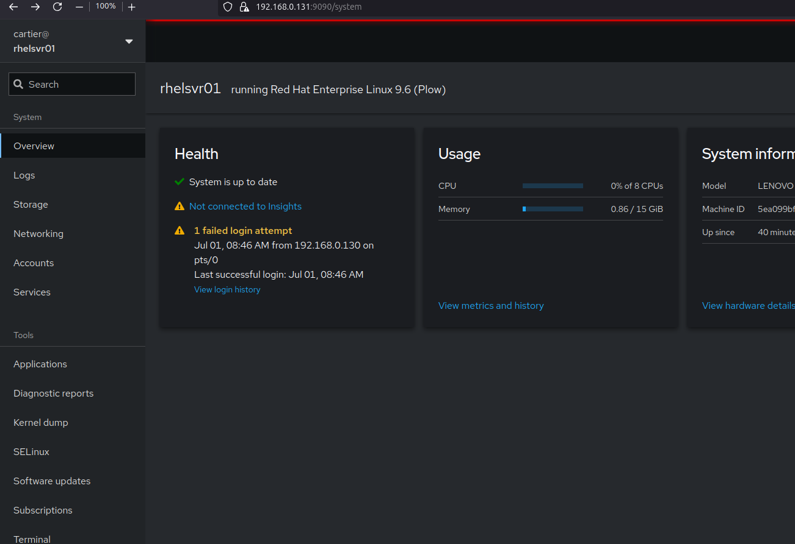
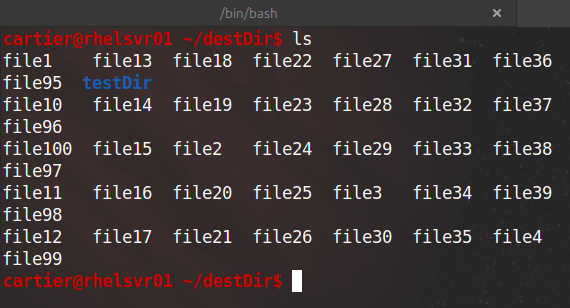
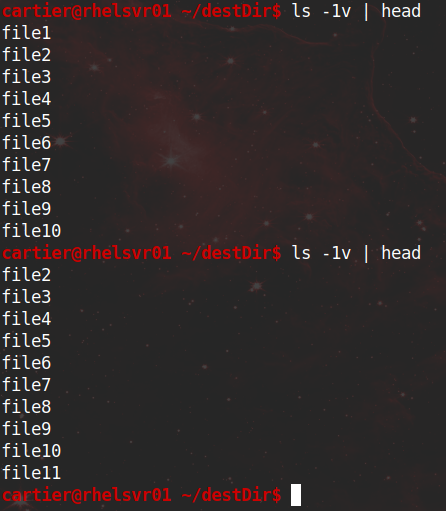
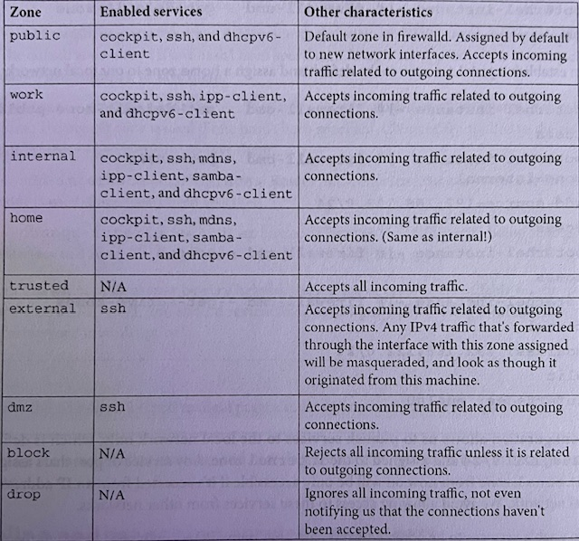
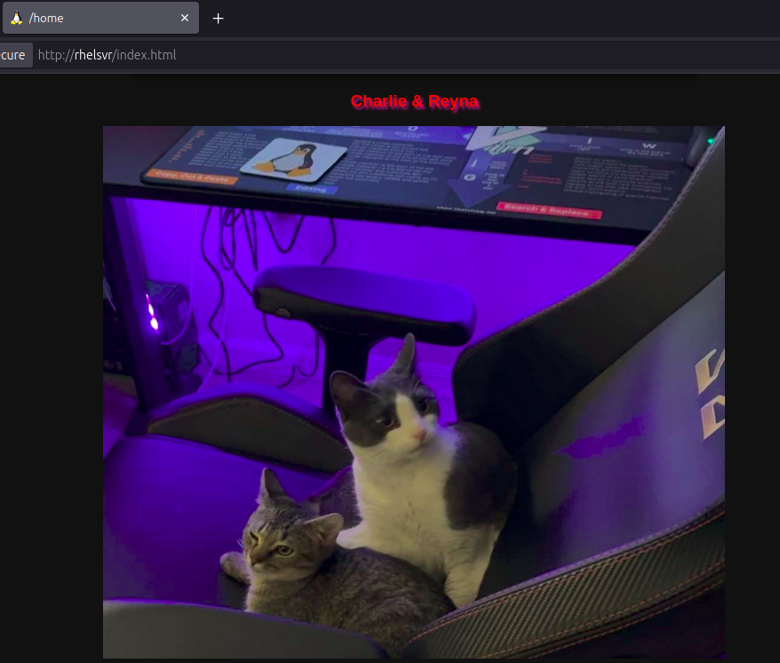

# RHCSA-Home-Lab

## Table of Contents

  - [Introduction](#intro)
  - [Inital Setup](#initial)
  - [Installing Cockpit](#cockpit)
  - [Package Management](#package)
  - [Rsync](#rsync)
  - [Firewalld](#firewall)
  - [SELinux](#selinux)
  - [Summary](#summary)

## <a name="intro"></a>Introduction 
I decided to try my luck at the RHCSA exam. I decided to use a mix of VM’s on Virtual Box and physical hardware to study for the Red Hat certification. I will be documenting some of what I learn while doing this lab in hopes that it helps reinforce the knowledge. By copying down the commands I run and looking them over I know it will help me retain the material. For this project I bought a refurbished Lenovo for $120 dollars with these specs:

Lenovo ThinkCentre M910S Intel i7 3.20 GHz, 16GB DDR4 RAM, 1TB SSD, and I installed an extra 256GB SSD.

***Lenovo ThinkCentre***
<p align="center"></p>
<p align="center"></p>

***CPU***
<p align="center"></p>

***Memory and Storage***
<p align="center"></p>

***Installed extra SSD***
<p align="center"></p>

**Side note:**

As an Ubuntu user, I noticed some things right away. The package managers yum and dnf update the local cache automatically when installing packages. In Ubuntu you would run ‘apt update’ then ‘apt install <package>’ to update the local cache to the latest and then install. With dnf you can run ‘dnf install <package>’ and it updates and installs packages automatically. Yum is sym-linked to dnf. Also, the /bin directory is sym-linked to /usr/bin along with a few other directories being linked to a /usr/* directory. 

## <a name="initial"></a>Initial Setup
I ran through the anaconda installer which is really nice. I went with the “minimal install” software option. Openssh-server is installed by default, so I will transfer over the public key from my desktop and laptop to the authorized_keys  file for easier access. I will be using SSH for everything after the initial setup. 

**First commands:**

```shell
# update system since its a fresh install
$ sudo dnf upgrade -y
# install tailscale to access server remotely
$ curl -fsSL https://tailscale.com/install.sh | sh
$ sudo tailscale up
$ sudo dnf install vim -y
# from main desktop to server
$ scp .vimrc cartier@rhelsvr01:
# cp .vimrc with personal preferences so new users also get file upon creation
$ sudo cp .vimrc /etc/skel/
```

## <a name="cockpit"></a>Installing Cockpit
Cockpit is a set of tools that allows for web management of the system. It is hosted at https://localhost:9090 after installing. You can access the terminal from the browser, view logs, update software, and view storage just to name a few.

```shell
$ sudo dnf install cockpit
# to start service now and enable persistence after reboots
$ sudo systemctl enable --now cockpit.socket
```

<p align="center"></p>

## <a name="package"></a>Package Management
The default repo’s after install did not have some tools in them and I realized after an internet search that I will need to add more repositories to allow these tools such as htop.

**Managing Repositories**

```console
$ sudo su -
# ls -l /etc/yum.repos.d/ # where .repo definitions live
# dnf install epel-release
# dnf repolist # check to see if repo was added
# dnf install htop
# dnf repolist --all # list disabled and enables repo's. prints very long list
# dnf repolist --all | grep supplementary 
# practice enabling and disabling a repo
# dnf config-manager --enable rhel-9-for-x86_64-supplementary-rpms #enable repo
# dnf config-manager --disable rhel-9-for-x86_64-supplementary-rpms #disable repo
# dnf info screen # search repo's for a package named screen
```

**Software Installs and Updates**

```console
# dnf install -y yum-utils 
# needs-restarting -r # check if needs restart after upgrading
# dnf install zip
# dnf check-update # check packages ready for update
# dnf upgrade
# dnf search wget # search packages available 
# dnf info wget # info on a package installed or not
# dnf remove screen -y # remove a package
# dnf grouplist | grep Tools # list package groups
# dnf groupinstall "System Tools"
# dnf history # history of installation transactions
# dnf history info 9 # info on ech transaction. 9 for me is tmux
```

**Rollbacks**

```console
# dnf install tree
# dnf history
# dnf history rollback 23 # rollback everything up until history of 23 in my case it only uninstalled tree 
# dnf history undo 25  # undo a single transaction.
```

**Modules**
Allows Red Hat to ship multiple supported versions of key software and you can enable or disable the ones you want.

```console
# man dnf.modularity
# dnf module list # list available modules in enabled repo's
# dnf module enable php:8.3/common # dnf module enable <name>:<stream>/<profile>
# dnf module list php # php  8.3 [e]. e means enabled
# dnf module list --enabled 
# dnf module reset php
# dnf module list php # php  8.3 [d] # d means disabled
```

**RPM**

```shell
$ rpm -ql openssh-server # list files included in package and configs
$ rpm -qa | less # search all installed packages. /openssh for faster search
$ sudo rpm -i ./package.rpm # install specified package but not dependencies
```

## <a name="rsync"></a>Rsync
Lets use rsync from my local machine to the server. I’ll start by creating a directory and put some junk files in there on my local machine.

```shell
# From my desktop I create a parent directory and a sub-directory:
$ mkdir srcDir && cd srcDir
$ touch file{1..100} # creates file1 - file99
$ for f in ./file*; do echo "testing rsync" >> $f; done # adding junk data to all the files at once
# i'll make another directory to test the recursion
$ mkdir testDir && cd testDir
$ touch test{1..100} 
# Below I append a / after srcDir to only cp files in srcDir and not the srcdir directory itself:
$ rsync -av srcDir/ cartier@rhelsvr:destDir/ 
```

**Now we see the files transferred recursively to the remote directory:**
<p align="center"></p>

**We can also delete files from the destDir that do not exist in srcDir after making changes:**

```shell
# From my desktop:
$ rm srcDir/file1 # rm file in srcDir
$ rsync -av --delete srcDir/ cartier@rhelsvr:destDir/ # now deletes file1 in destDir also
	sending incremental file list
	deleting file1
	./
	sent 2,804 bytes  received 25 bytes  1,886.00 bytes/sec
	total size is 1,386  speedup is 0.49
```

**Now we can see the change of the deleted file on the remote directory:**
<p align="center"></p>

## <a name="firewall"></a>Firewalld
Firewalld is a firewall management tool used on many Linux distributions. Firewalld has a few different configuration items:

Zones - a group of rules that can be activated together and assigned to a network interface.

Services - port or group of ports that must be configured together for a specific system service

Ports - a port number (80) and type of traffic (TCP) used to enable network traffic.

Running - rules applied to the active firewall configuration in memory (temporary).

Permanent - Rules that have been saved and will load when the system starts.

***ZONES:***
<p align="center"></p>

```console
$ man firewalld.zones 
$ rpm -qa | grep firewalld # installed by default but can check this way
$ sudo firewall-cmd --state # check to see if active
$ sudo su
# firewall-cmd --get-zones # list available zones: block dmz drop external home internal nm-shared public trusted work
# firewall-cmd --get-default-zone # public
# firewall-cmd --get-active-zones # list active zones and interfaces
# firewall-cmd --list-all # dumps current config
# firewall-cmd --list-services --zone=public # list configured services
```

***Managing Zones***

```console
# firewall-cmd --zone=internal --change-interface=tailscale0 --permanent
# firewall-cmd --reload # reload rules from changed configs
# firewall-cmd --list-all --zone=public
# firewall-cmd --list-all --zone=internal
```

***Enabling Services and Ports***

```console
# firewall-cmd --list-services --zone=public
		cockpit dhcpv6-client ssh # default zones of public
# dnf install httpd -y # install apache2
# systemctl enable --now httpd # start httpd to visit and test firewall
# firewall-cmd --add-service http --zone=public # adding http to a zone
# firewall-cmd --reload
# firewall-cmd --add-port 80/tcp --zone=public --permanent # this could also work 
```

***It worked. We can visit the web page.***

I copied over a web page I made of my cats to /var/www/html/
<p align="center"></p>

## <a name="selinux"></a>SELinux

## <a name="summary"></a>Summary

Enter summary here: Still in progress...

